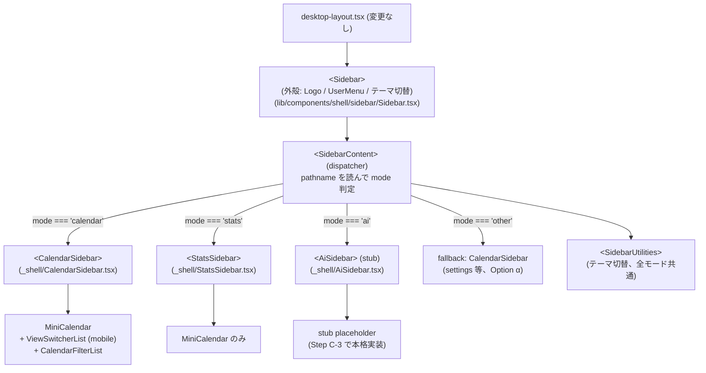

# Phase 2-C Step C-2 詳細設計: Sidebar モード別分離

> **策定日**: 2026-04-22
> **Parent**: [overview.md](./overview.md) §4 (Option Y)
> **前提**: Phase 2-C Step C-1 完了 (route group 移動 / commit `a2c962f5e` + `e66c103fa`)
> **Step**: 2-C-2 (未着手)
> **スコープ**: `SidebarContent` を `CalendarSidebar` / `StatsSidebar` / `AiSidebar` に分割し、pathname dispatch を実装

## Context

[overview.md §4](./overview.md#4-sidebar-外殻分離-option-比較と推奨) で採用した **Option Y (SidebarContent が pathname ディスパッチ)** の実装詳細を固める。Sidebar 外殻 (`<Sidebar>`) の位置は `desktop-layout.tsx` のまま不変、中身のみモード別 component に切替える。

Step C-2 は Phase 2-C の最大の構造変更ではあるが、**現状 SidebarContent は 98 行で責務が明確**なため、分割自体は単純。設計の主眼は (a) dispatch パターンの選択、(b) 共通要素と dispatch 対象の境界、(c) 新 component の配置場所。

---

## 章立て

1. [現状の SidebarContent 構造](#1-現状の-sidebarcontent-構造)
2. [目標構造 (Step C-2 完了後)](#2-目標構造-step-c-2-完了後)
3. [新規 component の配置場所](#3-新規-component-の配置場所)
4. [pathname dispatch の実装方針](#4-pathname-dispatch-の実装方針)
5. [各 Sidebar の責務と依存](#5-各-sidebar-の責務と依存)
6. [共通要素と dispatch 境界](#6-共通要素と-dispatch-境界)
7. [Feature-boundaries 影響評価](#7-feature-boundaries-影響評価)
8. [手動確認シナリオ](#8-手動確認シナリオ)
9. [ロールバック戦略](#9-ロールバック戦略)
10. [Sub-step 分割の判断](#10-sub-step-分割の判断)
11. [リスクと対策](#11-リスクと対策)
12. [相談事項](#12-相談事項-ユーザー判断が必要)

---

## 1. 現状の SidebarContent 構造

**ファイル**: [src/app/[locale]/(app)/\_shell/SidebarContent.tsx](<../../../../src/app/[locale]/(app)/_shell/SidebarContent.tsx>) (98 行)

### 責務

- Composition Layer として calendar / stats の機能を組み立てて render
- `pathname` に基づいて `isStatsPage` を判定し、`MiniCalendar` の date ソースと onSelect handler を分岐

### 現状の render ツリー

```
<SidebarContent>
  ├─ <MiniCalendar>                     L43-52, hidden md:block
  │    props: selectedDate / onDateSelect を isStatsPage で分岐
  ├─ <div className="...">              L55-61, 常時
  │    ├─ <ViewSwitcherList />          L57, md:hidden (モバイル sidebar 時のみ)
  │    └─ <CalendarFilterList />        L60, 常時
  └─ <SidebarUtilities />               L64-97, インラインで定義、テーマ切替
```

### 現状の依存

| Import                    | from                                | 用途                             |
| ------------------------- | ----------------------------------- | -------------------------------- |
| `CalendarFilterList`      | `@/features/calendar`               | タグフィルタ list                |
| `useCalendarNavigation`   | `@/features/calendar`               | Calendar の date / viewType      |
| `ViewSwitcherList`        | `@/features/calendar`               | Mobile 時の view 切替            |
| `useStatsFilterStore`     | `@/features/stats`                  | Stats の date                    |
| `MiniCalendar`            | `@/lib/components/ui/mini-calendar` | date picker UI                   |
| `Button` / `HoverTooltip` | `@/lib/components/ui/*`             | SidebarUtilities のテーマ切替 UI |
| `useTheme`                | `@/lib/hooks/useTheme`              | theme state                      |
| `usePathname`             | `next/navigation`                   | mode 判定                        |

### 現状の問題点 (Phase 2-C で解消)

1. **calendar + stats 両方を import** している (Composition Layer なので boundaries 違反ではないが、各モード時に不要な feature を pull している)
2. `isStatsPage` 分岐が `MiniCalendar` の props レベルで行われており、拡張 (AI モード追加) のたびに props 分岐が増える
3. AI モードを追加する場合、現状の分岐モデルでは `MiniCalendar` を render するかどうかも分岐点になり、if 地獄になる

### 呼び出し元

- [src/app/[locale]/(app)/\_shell/desktop-layout.tsx](<../../../../src/app/[locale]/(app)/_shell/desktop-layout.tsx>) L70-72 のみ

```tsx
<Sidebar>
  <SidebarContent />
</Sidebar>
```

props なし (Composition Layer で完全に閉じている)。

---

## 2. 目標構造 (Step C-2 完了後)



### 変更点サマリ

| 項目                      | 現状                                 | Step C-2 後                                                                    |
| ------------------------- | ------------------------------------ | ------------------------------------------------------------------------------ |
| `SidebarContent` の責務   | calendar + stats の UI を直接 render | **dispatcher**: pathname で mode 判定 + 対応する Sidebar component を render   |
| mode 判定                 | `isStatsPage` (単一 boolean)         | `getModeFromPath()` util 関数が `'calendar' / 'stats' / 'ai' / 'other'` を返す |
| `MiniCalendar` の配置     | `SidebarContent` 直下 + props 分岐   | 各 mode Sidebar 内に配置 (CalendarSidebar / StatsSidebar) ※ AiSidebar には無し |
| `SidebarUtilities` の配置 | `SidebarContent` 内にインライン定義  | 独立ファイル or `SidebarContent` 内で dispatch 外の共通領域に保持              |
| feature import            | calendar + stats 両方                | 各 mode Sidebar が自身の feature のみ import                                   |

---

## 3. 新規 component の配置場所

### 3.1 Option 比較

| Option | 配置場所                                                         | メリット                                                   | デメリット                                                                             |
| ------ | ---------------------------------------------------------------- | ---------------------------------------------------------- | -------------------------------------------------------------------------------------- |
| **a**  | `src/lib/components/shell/sidebar/`                              | Sidebar 関連 component と同居                              | `lib/` は feature 非依存のはず。`@/features/calendar` を import すると boundaries 違反 |
| **b**  | 各 feature 配下 (`src/features/calendar/components/sidebar/` 等) | feature 内部で閉じる                                       | Composition Layer ではなく feature 層に Composition を置くことになり、DAG 逆行         |
| **c**  | `src/app/[locale]/(app)/_shell/` (推奨)                          | 既存 `SidebarContent` と同居、Composition Layer として自然 | 特になし                                                                               |

### 3.2 推奨: Option c

**理由**:

1. **Composition Layer が正しい位置**: `_shell/` は既に Composition Layer として機能しており、`SidebarContent.tsx` もここにある。各モードの Sidebar は feature export + shared UI を合成する Composition そのもの
2. **feature-boundaries DAG に従う**: `_shell/` から `@/features/calendar` を import するのは許可されている方向 (上位 → 下位)
3. **`lib/components/shell/sidebar/` は feature 非依存を維持**: Sidebar 外殻 (`<Sidebar>` コンテナ) は feature 非依存の library として保つ。feature に依存する中身は Composition Layer 側に置く
4. **既存命名パターンとの整合**: `_shell/SidebarContent.tsx` / `_shell/SidebarPageNav.tsx` / `_shell/BottomTabBar.tsx` が既に Composition として配置済み

### 3.3 配置する新規ファイル

```
src/app/[locale]/(app)/_shell/
├── SidebarContent.tsx       (既存、dispatcher に書き換え)
├── CalendarSidebar.tsx      (新規)
├── StatsSidebar.tsx         (新規)
├── AiSidebar.tsx            (新規、stub)
├── SidebarUtilities.tsx     (新規、SidebarContent からインライン抽出)
└── navigation-paths.ts      (既存、getModeFromPath を追加)
```

### 3.4 命名規約

- **Component 名**: `CalendarSidebar` / `StatsSidebar` / `AiSidebar` (統一パターン)
- **ファイル名**: PascalCase で component 名に一致
- **export 形式**: **named export** (CLAUDE.md 準拠)
  ```tsx
  export function CalendarSidebar() { ... }
  ```

---

## 4. pathname dispatch の実装方針

### 4.1 pattern 比較

| Pattern                  | 実装イメージ                                      | 評価                                                               |
| ------------------------ | ------------------------------------------------- | ------------------------------------------------------------------ |
| **switch 文 (推奨)**     | `switch (mode) { case 'calendar': return <CS/> }` | 読みやすい、3 case なら冗長ではない、default で fallback が自然    |
| **object map**           | `const map = { calendar: CalendarSidebar, ... }`  | 5+ モードなら有利。3 モードで map 定義のオーバーヘッドの方が大きい |
| **モード別 layout 配置** | 各モード layout.tsx が `<Sidebar>` ごと描画       | Option X (却下済)                                                  |

### 4.2 推奨: switch 文

```tsx
// _shell/SidebarContent.tsx (書き換え後の擬似コード)
export function SidebarContent() {
  const pathname = usePathname() ?? '';
  const mode = getModeFromPath(pathname);

  return (
    <>
      {(() => {
        switch (mode) {
          case 'calendar':
          case 'other': // settings 等、fallback として calendar 扱い (Option α)
            return <CalendarSidebar />;
          case 'stats':
            return <StatsSidebar />;
          case 'ai':
            return <AiSidebar />;
        }
      })()}
      <SidebarUtilities />
    </>
  );
}
```

### 4.3 `getModeFromPath` util

**配置**: [src/app/[locale]/(app)/\_shell/navigation-paths.ts](<../../../../src/app/[locale]/(app)/_shell/navigation-paths.ts>) に追加 (既存 `getActivePageFromPath` / `buildCalendarPath` と同居)

**実装方針**:

```typescript
export type AppMode = 'calendar' | 'stats' | 'ai' | 'other';

export function getModeFromPath(pathname: string): AppMode {
  if (pathname.includes('/calendar/')) return 'calendar';
  if (pathname.includes('/stats')) return 'stats';
  if (pathname.includes('/ai')) return 'ai';
  return 'other';
}
```

**特徴**:

- pathname prefix 判定 (route group `(modes)` は URL に現れないため変更不要)
- 既存 `getActivePageFromPath(pathname): 'calendar' | 'stats'` を **置き換えない** (BottomTabBar / SidebarPageNav が使用中)。並存させる
- 判定は `includes()` ベースで locale prefix 非依存

**unit test**: [リスクと対策 §11 C6](#11-リスクと対策) で必須化。`_shell/__tests__/navigation-paths.test.ts` を新設。

### 4.4 未知 pathname への fallback (`'other'` 処理)

pathname が `/settings` や予期しないルートを指す場合:

| Option | 挙動                                      | 採用判断                                                                            |
| ------ | ----------------------------------------- | ----------------------------------------------------------------------------------- |
| α      | fallback = `CalendarSidebar` (現状と同じ) | **推奨**: 現状挙動を維持、Desktop で settings page は通常 dialog overlay で使わない |
| β      | fallback = 空 (`null` return)             | Sidebar 中身が空白になり違和感                                                      |
| γ      | fallback = 直前のモード記憶               | state 管理コストが出るが利得少 (YAGNI)                                              |

**推奨: Option α**。desktop で `/settings` 直接アクセスは稀 (通常は dialog で開く。user memory 記載)。Mobile では Sidebar が表示されないため影響なし。

### 4.5 AI モード pathname 判定の Step C-2 時点の扱い

**背景**: Step C-2 時点では `(modes)/ai/` が存在しない (Step C-3 で追加)。`getModeFromPath('/ja/ai')` は実在しないルートを指す。

**選択肢**:

| Option | 挙動                                                                                  | 採用判断                                                         |
| ------ | ------------------------------------------------------------------------------------- | ---------------------------------------------------------------- |
| α      | Step C-2 で `'/ai'` 判定も入れておき、`AiSidebar` stub 用意 (将来の接続点を先に作る)  | **推奨**: 接続点を統一、Step C-3 で route 追加するだけで機能する |
| β      | Step C-2 では calendar/stats のみ対応、`getModeFromPath` に `'ai'` を Step C-3 で追加 | switch 文の構造が 2 段階変更になり差分が散らばる                 |

**推奨: Option α**。`getModeFromPath` と `AiSidebar` stub を Step C-2 で先に整え、Step C-3 は route 追加と stub の中身充実のみに集中できる。

**Step C-2 時点の `AiSidebar` 中身**: 最小 stub。`<div>AI mode placeholder</div>` 程度でも dispatch の動作確認には十分。Step C-3 で §5 品質水準 ([overview.md §5](./overview.md#5-ai-モード-stub-設計)) に沿って充実させる。

---

## 5. 各 Sidebar の責務と依存

### 5.1 CalendarSidebar

**責務**: Calendar モード時の Sidebar 中身。MiniCalendar (date picker) + ViewSwitcherList (mobile 時の view 切替) + CalendarFilterList (タグフィルタ)。

**依存**:

| Import                  | from                                | 用途                         |
| ----------------------- | ----------------------------------- | ---------------------------- |
| `useCalendarNavigation` | `@/features/calendar`               | currentDate / navigateToDate |
| `ViewSwitcherList`      | `@/features/calendar`               | view 切替 UI                 |
| `CalendarFilterList`    | `@/features/calendar`               | タグフィルタ                 |
| `MiniCalendar`          | `@/lib/components/ui/mini-calendar` | date picker                  |

**render ツリー**:

```tsx
<>
  <MiniCalendar
    selectedDate={navigation?.currentDate}
    onDateSelect={(date) => navigation?.navigateToDate(date, true)}
    className="hidden md:block"
  />
  <div className="...">
    <ViewSwitcherList /> {/* md:hidden */}
    <CalendarFilterList />
  </div>
</>
```

**state 購読**:

- `useCalendarNavigation()` (context hook 経由で `useCalendarNavigationStore` に繋がる)
- `CalendarFilterList` 内部で `useCalendarFilterStore`
- `ViewSwitcherList` 内部で独自 hook

### 5.2 StatsSidebar

**責務**: Stats モード時の Sidebar 中身。Phase 2-A 確定事項として **MiniCalendar のみ** (独自タグフィルタは scope 外)。

**依存**:

| Import                | from                                | 用途                         |
| --------------------- | ----------------------------------- | ---------------------------- |
| `useStatsFilterStore` | `@/features/stats`                  | currentDate / setCurrentDate |
| `MiniCalendar`        | `@/lib/components/ui/mini-calendar` | date picker                  |

**render ツリー**:

```tsx
<MiniCalendar
  selectedDate={currentDate}
  onDateSelect={setCurrentDate}
  className="hidden md:block"
/>
```

### 5.3 AiSidebar (Step C-2 では stub)

**責務**: AI モード時の Sidebar 中身の placeholder。Step C-2 時点では dispatch 動作確認用の最小 component。Step C-3 で [overview.md §5.2](./overview.md#52-ai-sidebar-aisidebartsx) の 3 ブロック構成 (タイトル / 空 Conversations list / Soon セクション) に充実させる。

**Step C-2 時点の実装**:

```tsx
export function AiSidebar() {
  return (
    <div className="text-muted-foreground p-4 text-sm">
      {/* Step C-3 で Watching AI 用 content に置換 */}
      AI mode placeholder
    </div>
  );
}
```

**依存**: なし (stub は static)。

### 5.4 SidebarUtilities

**責務**: テーマ切替ボタン (全モード共通)。

**抽出**: 現状 `SidebarContent.tsx` L64-97 にインライン定義されているものを独立ファイル `_shell/SidebarUtilities.tsx` に切り出し。

**依存**:

| Import         | from                          | 用途       |
| -------------- | ----------------------------- | ---------- |
| `Button`       | `@/lib/components/ui/button`  | トグル UI  |
| `HoverTooltip` | `@/lib/components/ui/tooltip` | hover 説明 |
| `useTheme`     | `@/lib/hooks/useTheme`        | theme 切替 |
| `Moon` / `Sun` | `lucide-react`                | アイコン   |

**dispatch の外 (全モード共通)** で描画する。

---

## 6. 共通要素と dispatch 境界

### 6.1 dispatch の外 (全モード共通、`SidebarContent` が直接描画)

- **`SidebarUtilities`** (テーマ切替) — 全モードで表示
- (Logo / UserMenu は `<Sidebar>` 外殻側で描画、SidebarContent の管轄外)

### 6.2 dispatch の中 (モード別)

- `MiniCalendar` — Calendar / Stats は所有、AI は無し
- `ViewSwitcherList` — Calendar のみ (Mobile 時)
- `CalendarFilterList` — Calendar のみ
- (AI の placeholder は AiSidebar が所有)

### 6.3 SidebarPageNav の扱い (dispatch 外)

- `SidebarPageNav` は `desktop-layout.tsx` の AppHeader rightSlot に配置済み (SidebarContent の外)
- 他 2 箇所 (`CalendarViewClient.tsx` の独自ヘッダー、`stats/layout.tsx` の StatsLayoutShell) でも SidebarContent の外で描画
- **Step C-2 では触らない**。Step C-5 (PageNav 3 タブ化) でまとめて対応

### 6.4 Sidebar 外殻 (`<Sidebar>`) の変更なし

- `src/lib/components/shell/sidebar/Sidebar.tsx` は変更しない (feature 非依存のまま維持)
- Logo / UserMenu / collapse ボタンは Sidebar 外殻の責務

---

## 7. Feature-boundaries 影響評価

### 7.1 Step C-2 前後の依存グラフ

**現状**:

```
SidebarContent.tsx (Composition Layer)
  ├─→ @/features/calendar (CalendarFilterList, useCalendarNavigation, ViewSwitcherList)
  └─→ @/features/stats    (useStatsFilterStore)
```

Composition Layer から複数 feature への合成は DAG 的に合規。ただし **同一 component で両 feature に同時参照**しているため、どちらかの feature を触るたびに SidebarContent の blast radius が広がる。

**Step C-2 後**:

```
SidebarContent.tsx (dispatcher, feature 非依存)
  ├─→ ./CalendarSidebar ─→ @/features/calendar
  ├─→ ./StatsSidebar    ─→ @/features/stats
  ├─→ ./AiSidebar       (stub, 依存なし)
  └─→ ./SidebarUtilities ─→ @/lib/hooks/useTheme

getModeFromPath → navigation-paths.ts (pathname 依存のみ、feature 非依存)
```

**改善点**:

- `SidebarContent` 自体が feature を import しなくなる (dispatcher 専任)
- 各 mode Sidebar が単一 feature のみ import → blast radius が feature 境界に閉じる
- AI モード追加が既存 Sidebar に影響しない (新 component 追加のみ)

### 7.2 boundaries 違反チェック項目 (実装時)

- [ ] `npm run lint:boundaries` pass (Cross-feature imports 0 / Self-imports 0 維持)
- [ ] `CalendarSidebar.tsx` が `@/features/stats` を import していないこと
- [ ] `StatsSidebar.tsx` が `@/features/calendar` を import していないこと
- [ ] `AiSidebar.tsx` がどの feature も import していないこと (stub なので)
- [ ] 各 Sidebar が feature barrel 経由で import (deep import 禁止)

---

## 8. 手動確認シナリオ

### 8.1 Sidebar 分割の正常動作

1. `/ja/calendar/day` で CalendarSidebar が描画 (MiniCalendar + CalendarFilterList、Mobile では ViewSwitcherList も)
2. `/ja/calendar/week` に遷移 → CalendarSidebar 維持、date picker が新しい week に追従
3. `/ja/stats/review` に遷移 → StatsSidebar に切替 (MiniCalendar のみ、CalendarFilterList は消える)
4. `/ja/stats/progress` → StatsSidebar 維持、state は Stats store のみ
5. `/ja/ai` に URL 直打ち → `AiSidebar` の stub placeholder が描画 (Step C-2 時点では 404 が返る可能性。`(modes)/ai/` が Step C-3 まで不在のため、この項目は Step C-3 で再確認)
6. `/ja/settings` 直アクセス (Desktop) → fallback で CalendarSidebar が描画 (Option α)

### 8.2 再マウント 0 回の確認 (Option Y の採否検証)

React DevTools Profiler で Calendar ↔ Stats ↔ AI を往復:

- [ ] `<Sidebar>` (外殻) の再マウント **0 回**
- [ ] `<SidebarContent>` (dispatcher) の再マウント **0 回**
- [ ] `<SidebarUtilities>` の再マウント **0 回**
- [ ] `<CalendarSidebar>` / `<StatsSidebar>` / `<AiSidebar>` はモード切替時に**各 1 回ずつ**マウント/アンマウント (期待挙動)

### 8.3 state 保持の確認

- [ ] Calendar day → Stats → Calendar day: date / viewType 保持 (CalendarNavigationProvider が常時 mount のため)
- [ ] Stats review (granularity=week) → Calendar → Stats review: granularity 保持 (StatsFilterStore は store 永続)
- [ ] Calendar week view → Stats → Calendar: **week** が保持される (day にリセットされない) — `sidebar-persistence.spec.ts` の regression guard

### 8.4 i18n / theme

- [ ] ja / en 切替で全 Sidebar のテキストが正しく翻訳される
- [ ] テーマ切替 (SidebarUtilities) が全モードで動作

### 8.5 Storybook

- [ ] `Sidebar.stories.tsx` (既存 Story) が無限リロードなく起動
- [ ] Sidebar 外殻の mock が壊れていない

---

## 9. ロールバック戦略

### 9.1 Step C-2 単独 revert

- Step C-1 (route group 移動) は維持、Step C-2 コミットのみ戻す
- `git revert <step-c-2-commit>` で実施可能
- 依存関係なし: Step C-2 の変更は `_shell/` 配下に閉じており、他 Step と疎結合

### 9.2 部分失敗時の停止判断

実装中に以下が発生したら停止して原因調査:

| 状況                                        | 停止ポイント                                                                             |
| ------------------------------------------- | ---------------------------------------------------------------------------------------- |
| `npm run typecheck` fail                    | import path / 型不整合を特定してから再開                                                 |
| `npm run lint:boundaries` fail              | feature 違反。配置場所 (Option c) を再検討                                               |
| Calendar ↔ Stats 往復で state 保持されない | CalendarNavigationProvider の mount 位置が変わった可能性、base-layout-content.tsx を確認 |
| Sidebar 外殻が再マウントしている            | Option Y の前提崩壊。Profiler で原因特定、Phase 2-A §4 に戻して Option X / Z を再検討    |

---

## 10. Sub-step 分割の判断

### 10.1 分割案

| Sub-step | 内容                                                  | ファイル数           |
| -------- | ----------------------------------------------------- | -------------------- |
| C-2a     | `getModeFromPath` util + unit test                    | 2                    |
| C-2b     | `SidebarUtilities` 抽出                               | 2 (extract + update) |
| C-2c     | `CalendarSidebar` 抽出                                | 2                    |
| C-2d     | `StatsSidebar` 抽出                                   | 2                    |
| C-2e     | `AiSidebar` stub + SidebarContent dispatcher 書き換え | 2                    |

### 10.2 推奨: **分割しない (1 Step / 1 commit)**

**理由**:

1. **全体規模が小さい**: 98 行の SidebarContent を 4-5 ファイルに切り出す作業。累計 300 行未満
2. **各 sub-step に独立意味が薄い**: C-2a (util) 単体コミットは意味があるが、C-2c / C-2d は SidebarContent dispatcher がないと機能しない。分割しても中間コミットは half-working 状態
3. **Phase 2-B の教訓**: Phase 2-A の「Step 5-7 一括コミット」案は blast radius で却下されたが、本 Step は `_shell/` に閉じており blast radius が小さい
4. **bisect の観点**: 1 コミットにまとめれば「Step C-2 がバグを入れた」と特定可能。分割すると原因特定のコストが上がる

### 10.3 代替案: C-2a のみ先行分離

もし「util の単独 unit test を先に merge して confidence を上げたい」なら:

- **C-2a**: `getModeFromPath` + test を先行コミット (boundaries 影響なし、単独で完結)
- **C-2b-e**: 残りを 1 コミットに束ねる

ただし追加コミット分離の利得は小さいため、**デフォルトは 1 Step / 1 commit**。

---

## 11. リスクと対策

[overview.md §9.2](./overview.md#92-phase-2-c-固有の新規リスク) の C1-C10 のうち Step C-2 で顕在化するもの:

| #   | リスク                                                    | Step C-2 での対策                                                                                                                   |
| --- | --------------------------------------------------------- | ----------------------------------------------------------------------------------------------------------------------------------- |
| C4  | Storybook story の path 依存                              | `Sidebar.stories.tsx` は `MockSidebarContent` 使用 (実 `SidebarContent` を import していない) ため影響なし。念のため起動確認        |
| C6  | pathname dispatch で mode 判定ミス                        | `getModeFromPath` を独立 util + vitest unit test。locale prefix / query string / trailing slash / route group 境界の 10 ケース程度  |
| C8  | `APP_NAMESPACES` への `ai` 追加漏れ                       | **Step C-2 では不要** (AiSidebar stub は翻訳キー未使用)。Step C-3 で追加                                                            |
| -   | Sidebar 外殻の再マウント発生 (Option Y 前提崩壊)          | 8.2 の Profiler 確認を必須ゲートに。0 回でなければ原因特定まで merge しない                                                         |
| -   | `SidebarUtilities` 抽出による theme state 動作変化        | `useTheme` hook は global state で抽出に影響なし。Profiler + 手動切替で確認                                                         |
| -   | `CalendarNavigationProvider` state が dispatch で失われる | Provider は `base-layout-content.tsx` の常時 mount 位置のまま (変更しない)。CalendarSidebar unmount 時も state は Provider 側に保持 |

---

## 12. 相談事項 (ユーザー判断が必要)

### 相談 A. fallback ('other' モード) の挙動

- **A-1 推奨 Option α (CalendarSidebar にフォールバック)**: 現状挙動を維持、Desktop の `/settings` 直接アクセスは稀
- A-2 Option β (空 Sidebar): 違和感があるため非推奨
- A-3 Option γ (前モード記憶): YAGNI

### 相談 B. Step C-2 で AI pathname 判定を入れるか

- **B-1 推奨 Option α**: `getModeFromPath` に `'ai'` case + `AiSidebar` stub を先行で入れる。Step C-3 で route を追加するだけで完成
- B-2 Option β: Step C-2 では calendar/stats のみ対応。Step C-3 で `getModeFromPath` を拡張

### 相談 C. `SidebarUtilities` を独立ファイルに抽出するか

- **C-1 推奨: 抽出する** (`_shell/SidebarUtilities.tsx`)。SidebarContent dispatcher を純粋化 (dispatch 以外のロジックが混ざらない)
- C-2 抽出せず SidebarContent 内にインライン保持: 変更範囲は狭いが、dispatcher と UI 定義が混在

### 相談 D. Sub-step 分割

- **D-1 推奨: 分割しない** (1 Step / 1 commit)
- D-2 `getModeFromPath` + unit test のみ先行コミット (C-2a 分離): 利得小さい
- D-3 更に細かく分割: blast radius 小さい本 Step では過剰分割

### 相談 E. unit test の対象

- **E-1 推奨: `getModeFromPath` のみ unit test**。mode 判定が壊れると全 Sidebar が壊れる central point のため
- E-2 各 Sidebar にも render test: オーバーエンジニアリング、手動確認で十分
- E-3 Storybook story を新設 (CalendarSidebar.stories.tsx 等): Phase 2-D (後続) で検討

---

## Critical Files (Step C-2 スコープ)

### 既存変更

- [src/app/[locale]/(app)/\_shell/SidebarContent.tsx](<../../../../src/app/[locale]/(app)/_shell/SidebarContent.tsx>) — dispatcher に書き換え
- [src/app/[locale]/(app)/\_shell/navigation-paths.ts](<../../../../src/app/[locale]/(app)/_shell/navigation-paths.ts>) — `getModeFromPath` + `AppMode` type 追加

### 新規作成

- `src/app/[locale]/(app)/_shell/CalendarSidebar.tsx`
- `src/app/[locale]/(app)/_shell/StatsSidebar.tsx`
- `src/app/[locale]/(app)/_shell/AiSidebar.tsx` (stub)
- `src/app/[locale]/(app)/_shell/SidebarUtilities.tsx`
- `src/app/[locale]/(app)/_shell/__tests__/navigation-paths.test.ts` (unit test)

### 不変

- `src/lib/components/shell/sidebar/Sidebar.tsx` (外殻、feature 非依存のまま)
- `src/app/[locale]/(app)/_shell/SidebarPageNav.tsx` (Step C-5 で 3 タブ化)
- `src/app/[locale]/(app)/_shell/desktop-layout.tsx` (呼び出し側、`<SidebarContent />` のまま変更なし)
- `src/app/[locale]/(app)/_shell/base-layout-content.tsx` (CalendarNavigationProvider の位置)

---

## 推定作業量

| 工程                                                  | 時間         |
| ----------------------------------------------------- | ------------ |
| `getModeFromPath` util + unit test 作成               | 10 分        |
| `SidebarUtilities` 抽出                               | 5 分         |
| `CalendarSidebar` 抽出 (現 SidebarContent からコピー) | 10 分        |
| `StatsSidebar` 抽出 (MiniCalendar のみ)               | 5 分         |
| `AiSidebar` stub 作成                                 | 3 分         |
| `SidebarContent` を dispatcher に書き換え             | 5 分         |
| typecheck / lint / lint:boundaries / build            | 5 分         |
| 手動確認 (Profiler 含む)                              | 15 分        |
| commit + 報告                                         | 5 分         |
| **計**                                                | **60-70 分** |

---

## 次のアクション

1. 本設計書をレビュー
2. 相談事項 A-E のユーザー判断を確定
3. Step C-2 の実装プロンプトを詰める
4. 実装前に `git status` で clean 状態 (tag 関連 dirty のみ) を確認
