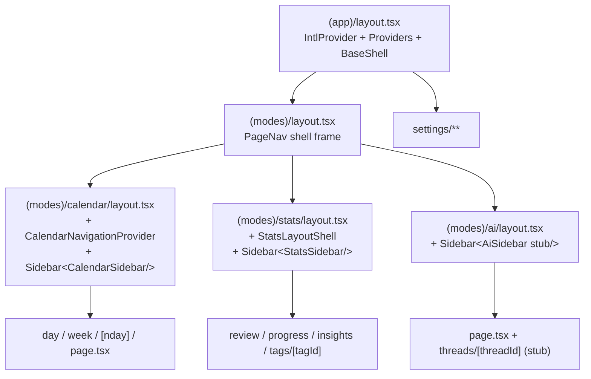

# Sidebar 再設計 実装プラン (Phase 2)

> **策定日**: 2026-04-22
> **対象**: Dayopt / `src/app/[locale]/(app)/**` の shell / composition / routing
> **Phase**: 2-A (本ドキュメント = 設計) → 2-B (router 統一) ✅ **完了 (2026-04-22)** → 2-C (layout 再編) 未着手
>
> **実施履歴**:
>
> - 2026-04-22: Phase 2-A 設計確定 + Phase 2-B 着手・完了 (8 コミット / -28 行)
> - Phase 2-B 実施後の所見と実績は [§10 Phase 2-B 実施後の気付き](#10-phase-2-b-実施後の気付き-2026-04-22-追記) を参照

## Context

現在 Dayopt のページ切替 (Calendar / Stats) は `window.history.pushState` + `useClientRouterStore` (Zustand) の二重管理で、`ClientPageRouter.tsx` が `clientPage` ストアを読んで Calendar/Stats を直接レンダリング (SSR children をバイパス) している。これは `router.push()` のサーバーラウンドトリップを回避して「Sidebar 静止 / メインのみ切替 (ChatGPT ライク)」を実現する**意図的な最適化**だが、AI モードを 3 つ目のトップレベルとして追加するにあたり、この特殊経路を続けると負債が増え続ける。

本ドキュメントは、Calendar / Stats / AI を兄弟ルートに並べ、各モードが独自の sidebar + main を持つ構造への移行計画。実装は Phase 2-B (router 統一) / Phase 2-C (layout 再編) で実施する。

## 章立て

1. [Scope と前提](#1-scope-と前提)
2. [Router 統一の論点と採用案](#2-router-統一-案比較と採用)
3. [Prefetch 整合方針](#3-prefetch)
4. [3 モード Layout 設計](#4-3-モード-layout-設計)
5. [Mobile 対応](#5-mobile-対応-確定)
6. [移行リスク + E2E 検証シナリオ](#6-移行リスク)
7. [Phase 2-B / 2-C 分割](#7-phase-2-分割)
8. [Phase 2-B 実装プロンプト骨子](#8-phase-2-b-実装プロンプト骨子)
9. [確定事項](#9-確定事項-相談事項への回答)
10. [Phase 2-B 実施後の気付き (2026-04-22 追記)](#10-phase-2-b-実施後の気付き-2026-04-22-追記)

---

## 1. Scope と前提

- 対象: `src/app/[locale]/(app)/**` の shell / composition / routing
- 対象外: feature 内部 (`src/features/calendar/**`, `src/features/stats/**`) の公開 API
- 遵守: Composition Layer / feature-boundaries DAG / `lib/stores/` cross-cutting / `APP_NAMESPACES` の grep チェック (`.claude/rules/architecture.md` の事故例)

## 2. Router 統一: 案比較と採用

| 観点          | A: router.push 一本化 | B: ClientPageRouter 保持 + AI 拡張 | C: layout 共通化 + router.push (採用) |
| ------------- | --------------------- | ---------------------------------- | ------------------------------------- |
| シンプルさ    | 高                    | 低                                 | 中-高                                 |
| Next.js 流    | ◎                     | ✕                                  | ◎                                     |
| Sidebar 静止  | △                     | ◎                                  | ◎                                     |
| AI 追加コスト | 小                    | 中                                 | 小                                    |
| 工数          | M                     | L                                  | M-L                                   |

### 採用: 案 C (layout 共通化 + router.push)

理由:

1. 3 モード構造と route group の自然な対応 (`(modes)/calendar` / `(modes)/stats` / `(modes)/ai`)
2. popstate/pushState 二重管理の撤去で `useClientRouterStore` / `resetToServer` を根絶
3. SSR prefetch を維持しつつ `<Link prefetch>` を補助に
4. AI を Composition Hub として段階的に追加可能

**不採用の理由**:

- **案 A**: `SidebarContent` が `isStatsPage` で feature store を分岐参照しているため、layout 分割なしの router.push 一本化だけでは sidebar の re-render を止めきれない。
- **案 B**: launch 前に最適化負債を解体する最後の機会。URL-driven の AI detail (`/ai/threads/[threadId]`) を `clientPage` 経由で表現するのは無理筋。

## 3. Prefetch

- 各 mode の `page.tsx` で既存の `prefetchCalendarData` / `prefetchStatsData` を維持
- モード間遷移 (`PageNav`, `BottomTabBar`) は `next/link` の `<Link prefetch>` に置換
- `CalendarNavigationProvider` は `(modes)/calendar/layout.tsx` 固有に戻す (Stats / AI では不要)
- 撤去する prefetch 経路なし

## 4. 3 モード Layout 設計

### 4.1 ルートグループ構造

```
src/app/[locale]/(app)/
├── layout.tsx                      IntlProvider + Providers + BaseShell (Sidebar なし)
├── _providers/
├── _shell/                         外殻 (header / bottom-tab / mode-page-nav)
├── _overlays/GlobalOverlays.tsx
├── (modes)/
│   ├── layout.tsx                  PageNav shell frame (妥協案では最小実装)
│   ├── calendar/
│   │   ├── layout.tsx              CalendarNavigationProvider + Sidebar<CalendarSidebar/>
│   │   ├── day|week|[nday]/page.tsx
│   ├── stats/
│   │   ├── layout.tsx              StatsLayoutShell + Sidebar<StatsSidebar/>
│   │   ├── review|progress|insights|badges|tags/[tagId]/page.tsx
│   └── ai/
│       ├── layout.tsx              Sidebar<AiSidebar stub/>
│       ├── _composition/           AI stub components (features/ai は作らない)
│       ├── page.tsx
│       └── threads/[threadId]/page.tsx (stub)
└── settings/                       現状維持 (モード外)
```

Mermaid 表現:



### 4.2 Sidebar 所有権

各 mode layout が `<Sidebar><{Mode}Sidebar/></Sidebar>` を描画。Next.js の partial rendering で Provider / Query キャッシュ / Inspector store は維持。Sidebar の中身はモード切替時に入替。

### 4.3 Sidebar 外殻共通化: **妥協案を初期実装として採用 (確定)**

- **初期実装 (Phase 2-C)**: 各モード layout が Sidebar 全体 (ロゴ + PageNav + UserMenu + 中身) を描画。モード切替で一瞬再マウントするが、PageNav の DOM 位置が同じなら視覚的ちらつきは最小。
- **後続最適化**: Phase 2-C 完了後に React DevTools Profiler + Playwright visual regression で Sidebar マウント回数と paint timing (p95 <= 16ms 目標) を測定。問題があれば Portal 方式 (`SidebarSlotContext.Provider` で中身注入) に切替。

Portal 方式は抽象化コストがあり、**妥協案で問題が顕在化しない限り導入しない**。

### 4.4 各 Sidebar 中身 (確定)

| モード   | 中身                                                          | データソース                                       | 備考                                                                                                                                                                       |
| -------- | ------------------------------------------------------------- | -------------------------------------------------- | -------------------------------------------------------------------------------------------------------------------------------------------------------------------------- |
| Calendar | MiniCalendar + ViewSwitcherList (mobile) + CalendarFilterList | `useCalendarNavigation` / `useCalendarFilterStore` | 現状維持                                                                                                                                                                   |
| Stats    | MiniCalendar のみ                                             | `useStatsFilterStore`                              | **今回は Stats 独自タグフィルタを追加しない**。tag-filter component の `features/tags` barrel 昇格 (calendar hub からの外出し) は scope 外。必要性が確認されたら別タスク。 |
| AI       | Conversations stub list                                       | -                                                  | **`src/features/ai/` の新設は Phase 2-C では行わない**。`(modes)/ai/_composition/` 内に stub component を配置。将来 Watching AI 本実装時に feature 昇格を判断。            |

## 5. Mobile 対応 (確定)

- **Tab 構成: 4 タブ** (Calendar / Stats / AI / Account) を採用
  - 3 モード化の目的と整合、AI 到達導線を確保
  - iOS / Material の 5 以下ガイドに収まる
  - 押しやすさは tab bar 高さ (現行 `h-14`) と 4 等分配分で担保 (具体は Phase 2-C 実装時)
  - **Account を header 退避する代替案は Discoverability 低下で不採用**
- **AI モード on Mobile**: plain list 全画面 → `/ai/threads/[threadId]` へ push navigation (iOS 標準パターン)
- **AI モード on Desktop**: Sidebar + Main の 2 カラム (stub)。将来 detail pane は CSS Grid で 3 カラム化

## 6. 移行リスク

| #   | リスク                               | 回避策                                                                                                                                                           | 検証                                 | Phase 2-B 実績                                                                                 |
| --- | ------------------------------------ | ---------------------------------------------------------------------------------------------------------------------------------------------------------------- | ------------------------------------ | ---------------------------------------------------------------------------------------------- |
| R1  | 戻る/進む                            | router.push 履歴で `usePathname` が自動同期                                                                                                                      | Playwright smoke                     | ✅ 発生せず。`mode-switching.spec.ts` で regression guard                                      |
| R2  | Deep link `/stats/tags/[tagId]`      | ClientPageRouter 撤去で自動解決                                                                                                                                  | Inspector → View Stats               | ✅ 解決。tagId 動的取得は Phase 2-C 以降に deferred (deep-link.spec は基本ルートのみ)          |
| R3  | SSR prefetch キャッシュ              | `HydrationBoundary` 経路維持                                                                                                                                     | DevTools + integration               | ✅ むしろ改善 — ClientPageRouter が CSR バイパスで prefetch を無効化していた欠損が副次的に解消 |
| R4  | i18n namespace                       | **`APP_NAMESPACES` 一括 load を維持 (確定)**。将来バンドルサイズ問題が顕在化したら再検討。grep チェック (architecture.md 事故例) を migration checklist に含める | `lint:i18n`                          | ✅ 発生せず。namespace 追加なしで完了                                                          |
| R5  | Sidebar ちらつき                     | Profiler 測定、問題時 Portal 方式へ                                                                                                                              | visual regression                    | 2-B では layout 再編なしのため未測定。Phase 2-C 着手時に測定                                   |
| R6  | Storybook mocks                      | `.storybook/mocks/stores.tsx` + `*.stories.tsx` grep                                                                                                             | storybook 起動                       | ✅ 発生せず。事前 grep `useClientRouterStore` 0 件確認が効いた (§8.3 の厳密化が機能)           |
| R7  | Inspector navigation                 | `resetToServer` 削除のみ                                                                                                                                         | 手動                                 | ⚠️ 事前想定外: Inspector 自動 close の既存欠損が手動確認で顕在化。`61c9071ec` で先行 fix       |
| R8  | `CalendarNavigationProvider` の位置  | `useCalendarNavigationStore` が state 保持                                                                                                                       | Calendar→Stats→Calendar で date 保持 | ✅ 維持。`sidebar-persistence.spec.ts` で verify                                               |
| R9  | `useShellStore.pageTitle` タイミング | 各 page `setPageTitle` 維持                                                                                                                                      | Mobile header title                  | ✅ 発生せず                                                                                    |
| R10 | iOS PWA sentinel                     | `ios-workarounds.ts` 独立                                                                                                                                        | 既存 E2E                             | ✅ 発生せず                                                                                    |

### 事前想定外のリスク (実施中に顕在化)

| #   | リスク                                           | 発生契機                                                                                        | 対処                                                                          |
| --- | ------------------------------------------------ | ----------------------------------------------------------------------------------------------- | ----------------------------------------------------------------------------- |
| X1  | Inspector 自動 close の既存欠損                  | Step 4 後の手動確認で発見                                                                       | `b063b711e` / `61c9071ec` で pathname-watch useEffect 追加                    |
| X2  | `mobile-navigation.spec.ts` の hidden regression | Step 3 の Link 化で `getByRole('button')` セレクタが失効していたが silent skip で気付けなかった | Step 7 で `getByRole('link')` + href 属性 assertion に書き換え                |
| X3  | `useInspectorURLSync` race condition             | 初回 Inspector close fix が router.push を cancel した                                          | close タイミングを handleViewStats から pathname 遷移後に移動 (X1 fix の詳細) |

### E2E 追加

- `e2e/smoke/mode-switching.spec.ts` — 3 モード往復 + 戻る
- `e2e/smoke/deep-link.spec.ts` — `/stats/tags/xxx` 直接 + Inspector 経由
- `e2e/smoke/sidebar-persistence.spec.ts` — Calendar date が Stats 経由で保持

## 7. Phase 2 分割

### 採用: 案 X (直列)

- **Phase 2-B**: router 統一 + `ClientPageRouter` 撤去 + `useClientRouterStore` 削除 (構造変更なし) — ✅ **完了 (2026-04-22)**
- **Phase 2-C**: `(modes)` route group 導入 + Sidebar モード別分離 + AI stub + 4 タブ化 — 未着手

**並列案を不採用の理由**: 2-B は約 5 ファイル、2-C は約 20 ファイル。レビュー粒度と blast radius を考えると分離が明らか。2-B の Sidebar ちらつき実測が 2-C の layout 設計判断 (妥協案 vs Portal) の決め手になる。

### Phase 2-B 実績 (2026-04-22 完了)

**コミット履歴** (時系列 / 8 コミット / ネット -28 行 / 13 ファイル変更):

| SHA         | 対応 Step                  | 内容                                                           |
| ----------- | -------------------------- | -------------------------------------------------------------- |
| `9918c31c9` | Step 2                     | `SidebarPageNav` を `next/link` ベース化 (動的 href + useMemo) |
| `dedc00dae` | Step 3                     | `BottomTabBar` を `next/link` ベース化 + test 書き換え         |
| `b063b711e` | 先行 fix (Step 4 手動確認) | View Stats 遷移時 Inspector close (初回 fix)                   |
| `ab5048a8c` | Step 4                     | `ClientPageRouter` 撤去により router.push 一本化               |
| `61c9071ec` | 追加 fix (X3)              | Inspector を Calendar 外遷移で close (race condition 修正)     |
| `69e1df5cc` | Step 5                     | noop となった `resetToServer` 呼び出しを撤去                   |
| `4192f2fe3` | Step 6                     | `useClientRouterStore` を削除                                  |
| `64c116206` | Step 7                     | Phase 2-B の routing 変更に E2E smoke test を追加              |

**スコープ調整**:

- Step 7 deep-link spec は tagId 動的取得を **Phase 2-C 以降 (tag feature E2E)** に deferred。2-B では `/stats/review` / `/calendar/week` の基本ルート SSR 描画のみを検証
- `sidebar-persistence.spec.ts` は ViewSwitcher UI 経由ではなく **URL 直接投入** で week view を起動 (動的 href テストを純粋化)
- `test.skip(testInfo.project.name.includes('Mobile'))` で viewport scoping を明示

## 8. Phase 2-B 実装プロンプト骨子

### 8.1 Step 一覧

| Step | 内容                                                     | 触るファイル                                                                                         | ゲート                           | 実績                                                                                                                                                 |
| ---- | -------------------------------------------------------- | ---------------------------------------------------------------------------------------------------- | -------------------------------- | ---------------------------------------------------------------------------------------------------------------------------------------------------- |
| 1    | grep 影響範囲確定                                        | -                                                                                                    | 参照一覧報告                     | ✅ 参照 6 箇所特定 (`SidebarPageNav` / `BottomTabBar` / `GlobalOverlays` / `TagFlatList` / store / Storybook mock)                                   |
| 2    | `SidebarPageNav` を `<Link>` ベース化                    | SidebarPageNav.tsx, PageNav.tsx                                                                      | typecheck / lint / 手動          | ✅ 動的 href を `useMemo` + `buildCalendarPath` / `buildStatsPath` で算出。nav セマンティクスに置換                                                  |
| 3    | `BottomTabBar` を `<Link>` ベース化                      | BottomTabBar.tsx, BottomTabBar.test.tsx                                                              | typecheck / lint / test          | ✅ `useRouter` / `useClientRouterStore` 依存撤去。test は pushState spy → href 属性 assertion に書き換え                                             |
| 4    | `ClientPageRouter` 削除 + `(app)/layout.tsx` 更新        | ClientPageRouter.tsx (削除), layout.tsx                                                              | **8.2 の手動確認シナリオ全通過** | ✅ 事前設計 ([step-4-detail.md](../sidebar-routing-unification/step-4-detail.md)) で「dead code 化済み」と確認してから削除。`_composition/` 自動削除 |
| 5    | `GlobalOverlays` + `TagFlatList` の `resetToServer` 撤去 | GlobalOverlays.tsx, TagFlatList.tsx                                                                  | typecheck / 手動 Inspector       | ✅ import + 呼び出し撤去。Inspector auto-close の既存欠損 (X1) が手動確認で顕在化 → 先行 fix として処理                                              |
| 6    | `useClientRouterStore` 削除 + Storybook mock 更新        | useClientRouterStore.ts (削除), .storybook/mocks/stores.tsx, \*.stories.tsx                          | **8.3 の Storybook 起動ゲート**  | ✅ grep 0 件確認後に `git rm`。Storybook mock 側の残骸参照もクリーンアップ                                                                           |
| 7    | E2E smoke 追加 + commit                                  | mode-switching.spec.ts / deep-link.spec.ts / sidebar-persistence.spec.ts / mobile-navigation.spec.ts | test:e2e:smoke                   | ✅ 3 spec 新規 + `mobile-navigation.spec.ts` の hidden regression (X2) を link セレクタに書き換え                                                    |

### 8.2 Step 4 手動確認シナリオ (ClientPageRouter 削除後の全通過が必須)

`npm run test:e2e:smoke` 相当の自動検証とは別に、以下を手動で全確認:

1. **Desktop Calendar ↔ Stats 往復**: Sidebar PageNav 経由で Calendar → Stats → Calendar。URL / active tab 同期、Sidebar 表示要素が正しく入替
2. **Mobile Calendar ↔ Stats 往復**: BottomTabBar 経由で同じ往復 (viewport 幅 <768px で確認)
3. **Deep link 直接アクセス**: `/ja/stats/tags/{有効な tagId}` を URL bar で直接開く → Stats tag detail が SSR で正しく描画
4. **ブラウザバック/フォワード**: Calendar → Stats → AI (2-B 時点では未実装なので Settings で代替) → back × 2 → Calendar に戻る。popstate 同期が壊れていない
5. **ページリロード**: Calendar day / Stats review / Settings 各直下で F5 → state (date, granularity 等) が URL queryParam から復元される
6. **Inspector → View Stats**: Calendar Inspector から「View Stats」クリック → `/stats/tags/{id}` へ遷移 + Inspector 自動 close

上記 6 シナリオすべて pass を Step 4 のゲートとする。1 つでも fail したら rollback して原因特定。

### 8.3 Step 6 Storybook 起動ゲート (無限リロード事故回避)

2026-04-22 の事故事例 (store リネーム時の `.storybook/mocks/stores.tsx` 見落としで無限リロード) を踏まえ、Step 6 のゲートを厳密化:

1. `grep -rn "useClientRouterStore" src .storybook tests` が **0 件**
2. `npm run typecheck` pass
3. `npm run lint` pass (`lint:boundaries` 含む)
4. `npm run storybook` 起動成功 → ブラウザで Storybook トップページが表示 (MISSING_MESSAGE や無限リロードが出ない)
5. 代表 stories の描画確認:
   - `Components/Shell/Sidebar/Container` (`Sidebar.stories.tsx`)
   - `Components/Shell/Sidebar/PageNav` (PageNav.stories.tsx があれば)
   - `Components/Shell/BottomTabBar` (BottomTabBar.stories.tsx があれば)

5 条件すべて pass で Step 6 完了。

**Phase 2-B 実績**: 無限リロードは**発生せず**。Step 1 の事前 grep で `useClientRouterStore` 参照 0 件を確認済みだったことが効いた (§8.3 の厳密化ゲートが機能)。Storybook mock 側の残骸 import のみ追加クリーンアップが必要だった程度。

### 8.4 Phase 2-B 全体のコミット戦略

Step 2〜7 を以下の 3〜4 コミットに整理:

| コミット   | 含む Step                | 理由                                                                                              |
| ---------- | ------------------------ | ------------------------------------------------------------------------------------------------- |
| コミット 1 | Step 2                   | `SidebarPageNav` の `<Link>` 化のみで独立。typecheck / lint 通過を個別に確認                      |
| コミット 2 | Step 3                   | `BottomTabBar` の `<Link>` 化 + test 更新。Mobile 固有の検証ポイントを分離                        |
| コミット 3 | Step 4                   | `ClientPageRouter` 削除は破壊的変更。最大の blast radius を独立コミットに                         |
| コミット 4 | Step 5 + Step 6 + Step 7 | 関連する cleanup (resetToServer 撤去 / store 削除 / Storybook mock 更新 / E2E 追加) を 1 コミット |

最終形: **3〜4 コミット** で Phase 2-B 完了。各コミットは `refactor(routing): ...` prefix で日本語メッセージ (CLAUDE.md commit 規約準拠)。

- コミット 1 例: `refactor(routing): SidebarPageNav を next/link ベースに移行`
- コミット 2 例: `refactor(routing): BottomTabBar を next/link ベースに移行`
- コミット 3 例: `refactor(routing): ClientPageRouter 撤去により router.push 一本化`
- コミット 4 例: `refactor(routing): useClientRouterStore 削除と関連 cleanup + E2E 追加`

**Phase 2-B 実績**: **8 コミット** で完了 (当初想定 3-4 コミット + 事前想定外の Inspector fix × 2 + cleanup の分割)。

- 当初想定 4 コミット分 (Step 2 / 3 / 4 / Step 5-7 一括) は計画通り分割できず、Step 5 / 6 / 7 / Inspector fix × 2 をそれぞれ独立コミットに分離
- 理由: Inspector auto-close の既存欠損 (X1) が Step 4 手動確認で顕在化し、router 変更本線と切り離すべき性質だった。また Step 5-7 一括案は blast radius が過大で、Step 単位に戻した
- 全コミットが `refactor(routing): ...` / `fix(routing): ...` / `test(e2e): ...` の日本語メッセージ (commitlint subject-case 準拠 = 先頭 lowercase)

## 9. 確定事項 (相談事項への回答)

| #   | 項目                       | 決定                                                                                   | 反映先   |
| --- | -------------------------- | -------------------------------------------------------------------------------------- | -------- |
| 1   | Sidebar ちらつき対策       | 妥協案を初期実装として採用。Portal 方式は Profiler 測定後に判断                        | 4.3      |
| 2   | Stats Sidebar タグフィルタ | 今回は追加しない。tag-filter barrel 昇格も scope 外                                    | 4.4      |
| 3   | AI feature 新設            | Phase 2-C では `(modes)/ai/_composition/` stub のみ。`src/features/ai/` 新設は将来判断 | 4.1, 4.4 |
| 4   | Mobile 4 タブ              | Calendar / Stats / AI / Account の 4 タブ。Account header 退避案は不採用               | 5        |
| 5   | `APP_NAMESPACES` 分割      | 現状維持 (一括 load)。バンドルサイズ問題が出たら再検討                                 | 6 R4     |

---

## 10. Phase 2-B 実施後の気付き (2026-04-22 追記)

Phase 2-B 実施 (8 コミット / 2026-04-22 完了) で得た、設計書策定時 (Phase 2-A) には見えていなかった知見を記録する。Phase 2-C 着手時の判断材料となる。

詳細な Phase 2-C 詳細設計は [overview.md](../sidebar-3-mode-structure/overview.md) を参照。

### 10.1 ClientPageRouter は実質 dead code だった

Step 2 (SidebarPageNav Link 化) + Step 3 (BottomTabBar Link 化) の時点で `useClientRouterStore.clientPage` は常時 `null` になり、`ClientPageRouter` の分岐レンダリングは実質 no-op 化していた。

- Step 4 で `ClientPageRouter` を削除した後も、Sidebar は**再マウントされなかった**
- これは Sidebar 静止が `ClientPageRouter` の寄与ではなく、**`desktop-layout.tsx` の layout スコープ (Next.js partial rendering)** で既に実現されていたことを意味する
- Phase 2-A で前提としていた「Sidebar ちらつき対策」の必要性自体が薄い

**Phase 2-C への影響**: Sidebar 外殻分離の Option 選択 (Phase 2-A §4.3) を再評価し、Option Y (SidebarContent の pathname ディスパッチ) を推奨する判断根拠となった。詳細は [overview.md §4](../sidebar-3-mode-structure/overview.md#4-sidebar-外殻分離-option-比較と推奨)。

### 10.2 SSR prefetch が CSR バイパスで壊れていた (副次的に解消)

`ClientPageRouter` は `clientPage` が設定されている間、SSR children をバイパスして直接 `<CalendarPage />` / `<StatsPage />` をレンダリングしていた。このため:

- SSR で実行された `prefetchCalendarData` / `prefetchStatsData` の結果 (dehydrated state) が CSR 側で**使われていなかった**
- 実質 prefetch 無効の状態で TanStack Query が初回 fetch を走らせていた

Step 4 での `ClientPageRouter` 撤去で、この欠損が副次的に解消された。初回モード遷移時の体感速度が向上しているはず (未計測)。

**Phase 2-C への影響**: `(modes)` 移動後も prefetch 経路 (各 page.tsx) を保持することを制約として明記 ([overview.md §9.1 R3](../sidebar-3-mode-structure/overview.md#91-phase-2-a-r1-r10-の再評価))。

### 10.3 `stats/layout.tsx` の二重定義経路が解消された

`ClientPageRouter` が `clientPage === 'stats'` で `<StatsPage />` を直接レンダリングしていた経路では `stats/layout.tsx` (= `StatsLayoutShell` ラッパー) が**bypass されていた**。Step 4 で撤去したことで、常に `stats/layout.tsx` 経由になり二重定義が解消。

**Phase 2-C への影響**: `(modes)/stats/layout.tsx` の維持が正当化された ([overview.md §12 相談事項 C](../sidebar-3-mode-structure/overview.md#12-相談事項-ユーザー判断が必要))。

### 10.4 Inspector 自動 close の既存欠損が手動確認で顕在化

Step 4 の手動確認シナリオ 6 (Inspector → View Stats) で、Inspector が Calendar 外遷移後も開いたまま残る既存欠損が発見された。

- 当初 `handleViewStats` 内で `closeInspector()` を呼ぶ fix (`b063b711e`) を投入したが、`useInspectorURLSync` の race condition で `router.replace` が `router.push` を cancel する事故が発生
- 最終 fix (`61c9071ec`): `GlobalOverlays` に pathname-watch `useEffect` を追加。Calendar 外 pathname になった時点で自動 close する宣言的実装

**Phase 2-C への影響**:

- pathname 判定は position-agnostic (`pathname.includes('/calendar/')`) のため `(modes)/calendar/` 移動後も機能する (K4)
- 「router 変更と UI fix を同一コミット/Step に混ぜない」原則が Phase 2-B で確立された。Phase 2-C でも同原則を維持する (相談事項 D の v2 デザイン別タスク化の根拠)

### 10.5 Hidden regression は silent skip で気付けない

`mobile-navigation.spec.ts` は Step 3 の Link 化で `getByRole('button')` セレクタが失効していた。しかし `TEST_USER_EMAIL` 未設定のため CI では silent skip され、regression に気付けなかった。Step 7 で link セレクタに書き換えて復旧。

**Phase 2-C への影響**:

- E2E spec のセレクタ変更は routing 変更と同じコミットで実施する
- `test.skip(!testInfo.project.name.includes('Mobile'))` 等の viewport scoping を明示し、意図しない skip を減らす
- Phase 2-C Step C-6 で 3 モード対応の追加 spec を書く際、既存 spec の修正漏れを grep チェック

### 10.6 コミット分割の実績と教訓

Phase 2-A §8.4 で想定した「Step 5-7 一括 = 1 コミット」案は blast radius が過大で、実際には各 Step を独立コミットに戻した。結果 8 コミット。

- **教訓**: 「cleanup 系コミットの一括化」は魅力的だが、各 Step の検証ゲートを独立に通したい場合は分離が正解
- Phase 2-C の Step 分割 ([overview.md §10.1](../sidebar-3-mode-structure/overview.md#101-step-一覧)) では最初から 6 Step / 6-7 コミットで計画する

---

## Critical Files

- ~~src/app/[locale]/(app)/\_composition/ClientPageRouter.tsx~~ — ✅ **2-B で削除済** (`ab5048a8c`)
- [src/app/[locale]/(app)/\_shell/SidebarPageNav.tsx](<../../../../src/app/[locale]/(app)/_shell/SidebarPageNav.tsx>) — ✅ 2-B で `<Link>` 化 (`9918c31c9`)、2-C で 3 タブ化
- [src/app/[locale]/(app)/\_shell/BottomTabBar.tsx](<../../../../src/app/[locale]/(app)/_shell/BottomTabBar.tsx>) — ✅ 2-B で `<Link>` 化 (`dedc00dae`)、2-C で 4 タブ化
- [src/app/[locale]/(app)/\_shell/SidebarContent.tsx](<../../../../src/app/[locale]/(app)/_shell/SidebarContent.tsx>) — 2-C で mode ディスパッチに拡張 (Option Y)
- [src/app/[locale]/(app)/layout.tsx](<../../../../src/app/[locale]/(app)/layout.tsx>) — ✅ 2-B で役割縮小、2-C で `APP_NAMESPACES` に `'ai'` 追加
- ~~src/lib/stores/useClientRouterStore.ts~~ — ✅ **2-B で削除済** (`4192f2fe3`)
- [src/app/[locale]/(app)/\_overlays/GlobalOverlays.tsx](<../../../../src/app/[locale]/(app)/_overlays/GlobalOverlays.tsx>) — ✅ 2-B で `resetToServer` 撤去 (`69e1df5cc`) + Inspector pathname-watch 追加 (`61c9071ec`)
- [src/features/calendar/components/tag-filter/components/TagFlatList.tsx](../../../../src/features/calendar/components/tag-filter/components/TagFlatList.tsx) — ✅ 2-B で import 削除
