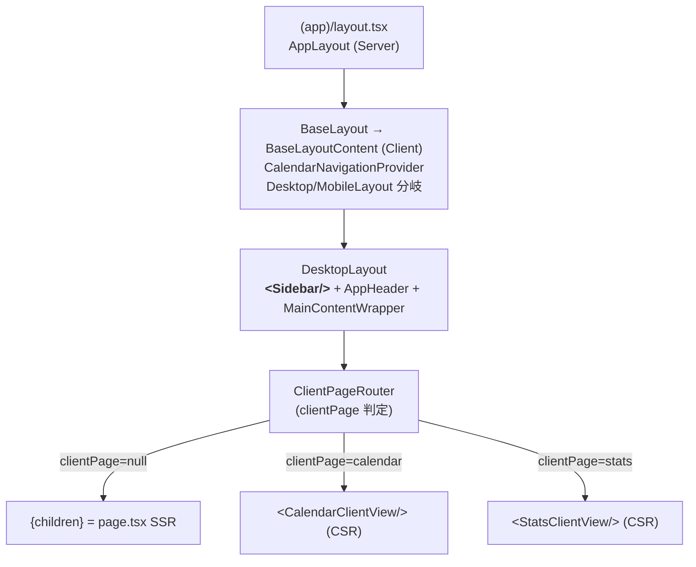
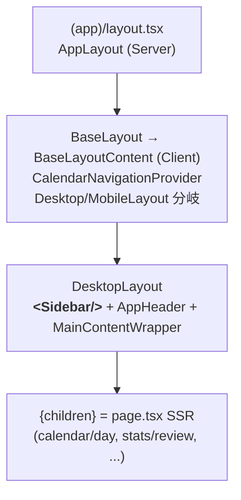

# Phase 2-B Step 4 詳細設計 — ClientPageRouter 撤去

> **策定日**: 2026-04-22
> **対象**: `src/app/[locale]/(app)/_composition/ClientPageRouter.tsx` 撤去
> **親 Plan**: `../sidebar-redesign/overview.md` §8 Phase 2-B 実装プロンプト骨子

## 結論 (TL;DR)

- **ClientPageRouter は実質冗長**。Sidebar 静止は現状すでに `DesktopLayout` の layout スコープで実現されている。撤去しても partial rendering で Sidebar は維持される
- **prefetch は改善方向**。撤去後は各 `page.tsx` の SSR prefetch (`prefetchCalendarData` / `prefetchStatsData`) が効くようになり、初回遷移時のデータ取得が高速化
- **stats 配下は既存 `stats/layout.tsx` が正規ルート**。ClientPageRouter 内で CSR 的に StatsLayoutShell を再構築していた経路が消え、Next.js 自然な routing に戻る
- **実装対象は 2 ファイル**: `layout.tsx` から参照を撤去 + `ClientPageRouter.tsx` 削除

---

## 1. ClientPageRouter.tsx の現状理解

### 1.1 全体構造 (139 行)

**責務**: `children` (= page.tsx SSR 出力) と `useClientRouterStore.clientPage` を見比べ、**clientPage が non-null なら SSR children をバイパスして `CalendarViewClient` / `StatsClientView` を直接 render する**。

**受け取る state / props**:

- props: `{ children: React.ReactNode }` (SSR 出力)
- store: `clientPage` / `switchToPage` / `resetToServer` (useClientRouterStore)
- `pathname` (usePathname)

**children の扱い**:

- `clientPage` が null → `{children}` をそのまま render (= SSR 出力表示)
- `clientPage` が 'calendar' → `<CalendarClientView />` を render (children 無視)
- `clientPage` が 'stats' → `<StatsClientView />` を render (children 無視)
- `clientPage && clientPage !== actualPageType` (/stats/tags/xxx 等への router.push 後) → `{children}` にフォールバック

**popstate listener** (L109-121):

```tsx
useEffect(() => {
  const handlePopState = () => {
    const pageType = getPageType(window.location.pathname);
    if (pageType === 'calendar' || pageType === 'stats') switchToPage(pageType);
    else resetToServer();
  };
  window.addEventListener('popstate', handlePopState);
  return () => window.removeEventListener('popstate', handlePopState);
}, [switchToPage, resetToServer]);
```

→ ブラウザバック/フォワード時に clientPage を pathname と同期。

**SSR と CSR の境界**:

- SSR 初回レンダリング時: clientPage = null (Zustand 初期値) → children (SSR 出力) が表示される
- その後 Step 2-3 以前の実装では、PageNav クリックで `window.history.pushState` + `switchToPage` により **router を介さず** clientPage を書換 → ClientPageRouter が再レンダリングして CalendarClientView/StatsClientView を CSR 描画していた
- **Step 2-3 で Link 化済み**のため、現状すでに clientPage は常に null のまま → ClientPageRouter は常に children を通すだけ = **冗長**

### 1.2 layout.tsx での使われ方

[src/app/[locale]/(app)/layout.tsx](<../../../../src/app/[locale]/(app)/layout.tsx>):

| 行     | 内容                                                                         |
| ------ | ---------------------------------------------------------------------------- |
| L11    | `* - ClientPageRouter: クライアントサイドページ切り替え` (JSDoc コメント)    |
| L30    | `import { ClientPageRouter } from './_composition/ClientPageRouter';`        |
| L54-65 | `AppLayout` 関数本体 (async Server Component)                                |
| L59    | `<ClientPageRouter>{children}</ClientPageRouter>` を `BaseLayout` の中で描画 |

構造:

```tsx
<IntlProvider>
  <Providers>
    <BaseLayout>
      <ClientPageRouter>{children}</ClientPageRouter> ← L59
      <GlobalOverlays />
    </BaseLayout>
  </Providers>
</IntlProvider>
```

children に渡されるもの: 各 page.tsx (calendar/day, stats/review, settings/[category] 等) の出力。stats は `stats/layout.tsx` → `StatsLayoutShell` → page.tsx の層を経由。

### 1.3 削除前後の children flow 比較

**削除前**:



**削除後**:



**違い**:

- ClientPageRouter 層が消える
- Sidebar は **DesktopLayout スコープ** のまま = 層構造に変化なし
- Calendar/Stats の CSR バイパス経路が消え、**SSR children が正規ルート**に一本化

---

## 2. 影響を受ける可能性のある箇所

### 2.1 Calendar / Stats の page.tsx

**Calendar** ([calendar/day/page.tsx](<../../../../src/app/[locale]/(app)/calendar/day/page.tsx>)):

```
DayPage (async Server)
  <Suspense fallback={CalendarSkeleton}>
    DayPageContent (async)
      prefetchCalendarData → HydrationBoundary
        <CalendarViewClient translations={...} />
```

`CalendarViewClient` は `SidebarPageNav` を `rightSlot` として内蔵し (L114)、CalendarController を描画。

**Stats review** ([stats/review/page.tsx](<../../../../src/app/[locale]/(app)/stats/review/page.tsx>)):

```
ReviewPage
  <Suspense fallback={ReviewSkeleton}>
    ReviewContent
      prefetchStatsData → HydrationBoundary
        FeatureErrorBoundary
          <StatsView />
```

**Stats layout** ([stats/layout.tsx](<../../../../src/app/[locale]/(app)/stats/layout.tsx>)):

```tsx
export default function StatsLayout({ children }) {
  return <StatsLayoutShell headerRightExtra={<SidebarPageNav />}>{children}</StatsLayoutShell>;
}
```

ClientPageRouter 撤去の影響:

- **Calendar 系**: ClientPageRouter 経由で描画されていた `CalendarClientView` と、page.tsx → `CalendarViewClient` は**実質同一 component**。プレース位置が layout 階層に変わるだけ
- **Stats 系**: ClientPageRouter 経由で `StatsLayoutShell` を CSR で再構築していた ([ClientPageRouter.tsx:70](<../../../../src/app/[locale]/(app)/_composition/ClientPageRouter.tsx#L70>))。撤去後は `stats/layout.tsx` が自然に適用される (同一の `headerRightExtra={<SidebarPageNav/>}` で SSR)
- **prefetch**: 現状 CSR バイパスでは `prefetchCalendarData` / `prefetchStatsData` が動かず tRPC キャッシュ頼り。撤去後は SSR prefetch + HydrationBoundary 経路 = **データ取得高速化**

**ClientPageRouter バイパス前提コード**: なし。Calendar/Stats の各 page.tsx と stats/layout.tsx はすべて「普通の Next.js ルート」として独立して動作する設計。

### 2.2 base-layout-content.tsx

[\_shell/base-layout-content.tsx](<../../../../src/app/[locale]/(app)/_shell/base-layout-content.tsx>) は:

- `CalendarNavigationProvider` で children をラップ (**常時マウント**で安定化)
- `useMediaQuery` で Desktop/Mobile 分岐
- `TrialEndedDialog` / `PaymentErrorDialog` をグローバル描画

ClientPageRouter への参照・依存は**なし**。撤去後も挙動不変。Step 1 調査の「調整不要」判定を改めて確認した。

### 2.3 layout.tsx の役割変化

撤去後の layout.tsx:

```tsx
export default async function AppLayout({ children }: AppLayoutProps) {
  return (
    <IntlProvider namespaces={APP_NAMESPACES}>
      <Providers>
        <BaseLayout>
          {children} {/* ← ClientPageRouter ラップを外す */}
          <GlobalOverlays />
        </BaseLayout>
      </Providers>
    </IntlProvider>
  );
}
```

`async` 維持可 (Next.js は async Server Component を許容)。役割は「i18n + Providers + Shell のラッピング」に純化。

---

## 3. popstate 同期の扱い

### 3.1 現状の popstate handler

[ClientPageRouter.tsx:109-121](<../../../../src/app/[locale]/(app)/_composition/ClientPageRouter.tsx#L109-L121>):

- popstate で `window.location.pathname` から `pageType` を算出
- calendar/stats ならば `switchToPage(pageType)` で clientPage を同期
- それ以外 (settings 等) は `resetToServer()` で clientPage = null

### 3.2 削除後の popstate 同期

**追加ロジック不要**。理由:

- Step 2-3 で Link 化済みのため、PageNav クリックは `router.push` 経由 (Next.js 内部)
- Next.js App Router の `usePathname` は popstate に反応して自動更新される
- `SidebarPageNav.tsx:37` と `BottomTabBar.tsx` の active 判定は `getActivePageFromPath(pathname ?? '/')` で pathname から直接算出 → popstate で pathname 更新 → 自動で active tab 切替
- ClientPageRouter 撤去に合わせて popstate 追加ロジックは不要

**確認済みの自動同期**:

- URL 同期 (`usePathname`): Next.js 標準
- PageNav active: `getActivePageFromPath(pathname)` に依存
- Sidebar 中身: `SidebarContent.tsx:27-29` で `pathname?.includes('/stats')` を参照 → 自動切替

---

## 4. SSR children バイパス問題

### 4.1 現状: CSR バイパス

ClientPageRouter が clientPage state に基づいて SSR children を**無視**して CSR で直接 render する経路があった。この経路は Step 2-3 以降は実質 dead (clientPage が常に null)。

### 4.2 削除後の各シナリオ

| シナリオ                        | 削除後の挙動                                                                            | リスク                            |
| ------------------------------- | --------------------------------------------------------------------------------------- | --------------------------------- |
| 初回アクセス `/ja/calendar/day` | page.tsx SSR → prefetch + HydrationBoundary → CalendarViewClient                        | なし                              |
| 初回アクセス `/ja/stats/review` | stats/layout.tsx + page.tsx SSR → StatsLayoutShell + StatsView                          | なし                              |
| Calendar → Stats 遷移 (Link)    | Next.js routing → stats/review の SSR (prefetch キャッシュ優先) → StatsLayoutShell 描画 | partial rendering で Sidebar 静止 |
| Stats → Calendar 遷移 (Link)    | Next.js routing → calendar/day (動的 href で view/date 保持) SSR                        | partial rendering で Sidebar 静止 |
| ブラウザリロード                | 各 page.tsx SSR                                                                         | なし                              |
| Deep link `/ja/stats/tags/xxx`  | stats/layout.tsx + stats/tags/[tagId]/page.tsx SSR                                      | なし                              |

**UX 退行の懸念点と対策**:

- **切替時の一瞬の白画面**: Suspense fallback (CalendarSkeleton / ReviewSkeleton) が出る可能性。ただし prefetch キャッシュが効けば fallback を回避できる → `<Link prefetch>` で cover 済み
- **Sidebar ちらつき**: 下記 4.3 参照
- **HydrationBoundary の二重ハイドレーション**: なし (Calendar は元々 page.tsx 経由、Stats は ClientPageRouter 経由から layout 経由に変わるが、HydrationBoundary は page.tsx スコープなので影響なし)

### 4.3 Sidebar 再マウント問題

**結論: ClientPageRouter 撤去後も Sidebar は再マウントされない**。

根拠: 現状すでに Sidebar は [DesktopLayout.tsx:70-73](<../../../../src/app/[locale]/(app)/_shell/desktop-layout.tsx#L70-L73>) で描画されており、この位置は `(app)/layout.tsx` → `BaseLayout` → `BaseLayoutContent` → `DesktopLayout` の**layout 階層**。

Next.js App Router の partial rendering 仕様:

- 同じ layout の下で children (= 別 page) が切替わる場合、layout 自体は**再マウントされない**
- `(app)/layout.tsx` / `BaseLayout` / `BaseLayoutContent` / `DesktopLayout` は全ての `(app)` 配下ページで共通
- Sidebar は DesktopLayout スコープ = **Calendar ↔ Stats 遷移で再マウントされない**

同様に BottomTabBar は MobileLayout スコープで、mobile ルート間遷移で再マウントされない。

→ **ClientPageRouter の「Sidebar 静止最適化」は既に layout 階層で実現済み**であり、ClientPageRouter 自体は Sidebar 静止に貢献していなかった。撤去しても Sidebar 静止は維持される。

---

## 5. 手動確認シナリオの詳細化 (Step 4 固有)

親 plan (`../sidebar-redesign/overview.md` §8.2 Step 4 手動確認シナリオ) の 6 項目を Step 4 観点で詳細化。

### シナリオ 1: Desktop Calendar ↔ Stats 往復

**何を見るか**:

- URL 遷移 (`/ja/calendar/day?date=...` ↔ `/ja/stats/review?g=...&d=...`)
- Sidebar の**再マウントが発生しないこと** (React DevTools Profiler で Sidebar component を watch、commit 数が 0 であることを確認)
- Sidebar 内 MiniCalendar の選択日付が保持
- Sidebar 内タグリストのスクロール位置が保持
- AppHeader (Calendar/Stats は独自ヘッダー、それ以外は共通) の切替

**pass 条件**:

- URL 両方向で正しく遷移
- Sidebar の re-render はあっても remount はゼロ (props 変化による re-render は OK)
- 切替時の白画面 / skeleton が 100ms 以下 (prefetch キャッシュヒット想定)

**失敗パターン例**:

- Sidebar 全体が一瞬消えて再描画される → layout partial rendering が壊れている
- MiniCalendar の選択日付がリセット → state が再マウントで消えた
- Skeleton が 500ms 以上表示される → prefetch キャッシュが効いていない (Link prefetch または viewport 問題)

**再現手順**:

1. `/ja/calendar/day` にアクセス → MiniCalendar で別日を選択
2. Sidebar の Stats アイコンをクリック → `/ja/stats/review` に遷移
3. Sidebar の Calendar アイコンをクリック → `/ja/calendar/day` に戻る
4. 1 で選択した日付が MiniCalendar で保持されているか確認

### シナリオ 2: Mobile BottomTabBar 経由往復

**何を見るか**:

- BottomTabBar の**再マウントが発生しないこと** (MobileLayout partial rendering)
- `pb-16` main content 余白が維持
- `useHideOnScroll` の hidden state が適切にリセット (pathname 変更で reset 発火)

**pass 条件**:

- 3 タブ (Calendar/Stats/Account) 間を往復して BottomTabBar が常に表示
- MainContentWrapper の padding-bottom が tab 分確保されたまま

**失敗パターン例**:

- BottomTabBar が一瞬消える → MobileLayout スコープが壊れている
- Tab アイコンが空の状態から描画される → Avatar or Icon の hydration mismatch

**再現手順**: viewport <768px で上記シナリオ 1 と同じ手順を実施。

### シナリオ 3: Deep link 直接アクセス `/ja/stats/tags/{tagId}`

**何を見るか**:

- SSR で正しく stats/layout + tags/[tagId]/page.tsx が描画される
- Sidebar が**最初から表示されている** (SSR 出力に含まれる)
- URL bar と active tab (Stats) が一致

**pass 条件**:

- URL 直接叩いて 1 回の HTTP リクエストで完全な HTML が返る
- JS 無効でも Sidebar HTML 構造は存在 (progressive enhancement)
- JS 有効時、hydration 完了後に MiniCalendar 等が interactive に

**失敗パターン例**:

- Sidebar が一瞬消えて復活 → layout の再マウントが起きている
- 404 相当の白画面 → ClientPageRouter の `clientPage !== actualPageType` フォールバックに依存していた可能性 (削除後は不要、Next.js が直接正規ルートを解決)

**再現手順**:

1. 既存タグの URL を取得 (例: Calendar でタグを作成 → Stats Inspector 経由で URL 確認)
2. 別タブで `/ja/stats/tags/{tagId}` を直接 paste
3. 初期表示が正常 (Sidebar + stats header + tag detail content) か確認

### シナリオ 4: ブラウザバック / フォワード

**何を見るか**:

- popstate で pathname 更新 → PageNav active tab 自動切替
- Sidebar content (MiniCalendar / CalendarFilterList / ViewSwitcherList) が pathname 変化に追従

**pass 条件**:

- 戻る/進むで URL が前状態に復元
- active tab 強調が URL と一致
- `useCalendarNavigation` / `useStatsFilterStore` の state が URL query param から正しく復元

**失敗パターン例**:

- 戻ってもタブハイライトが変わらない → `getActivePageFromPath` 呼び出しに問題
- 戻ったら Calendar state がリセット → CalendarNavigationProvider が常時マウントされていない

**再現手順**:

1. `/ja/calendar/day` → Stats へ → Settings へ → 戻る × 2 で Calendar に戻る
2. 各ステップで URL / active tab / Sidebar content の整合確認

### シナリオ 5: ページリロード (F5)

**何を見るか**:

- 各 page.tsx の SSR 出力がそのまま表示される
- query param (`date` / `g` / `d`) が state に復元
- CalendarNavigationProvider が pathname を正しく parse

**pass 条件**:

- Calendar day で `?date=2026-04-20` → リロード後も 2026-04-20 が選択状態
- Stats review で `?g=month&d=2026-03-01` → リロード後も month granularity / 2026-03-01 選択
- Settings 各カテゴリページでも同様

**失敗パターン例**:

- リロード後 default 値に戻る → query param 読み取りが layout 階層で壊れている

**再現手順**:

1. Calendar week で 2026-04-15 を選択 → URL `?date=2026-04-15` 確認 → F5 → 2026-04-15 が維持されるか
2. Stats で granularity = month、date 変更 → URL 確認 → F5

### シナリオ 6: Inspector → View Stats ナビゲーション

**何を見るか**:

- Calendar Inspector 「View Stats」クリック → `/stats/tags/{id}` へ router.push
- Inspector 自動 close
- Stats tag detail 画面が正常描画

**pass 条件**:

- GlobalOverlays.handleViewStats が動作
- `resetToServer()` 呼出は残っているが noop (clientPage 常に null のため)
- Step 5 で撤去予定、本 Step では挙動維持が目標

**失敗パターン例**:

- Inspector が閉じない → Inspector close ロジックの問題 (resetToServer 無関係)
- tag detail が表示されない → Stats routing 問題

**再現手順**:

1. Calendar で任意の entry をクリック → Inspector 開く
2. Inspector で tag をクリック → 「View Stats」ボタン → クリック
3. `/stats/tags/{tagId}` に遷移、Inspector が自動 close

---

## 6. Rollback 戦略

### 6.1 Step 4 単独 revert の可否

**可能**。Step 2/3 のコミットは Link 化のみであり、ClientPageRouter の存在を前提としていない:

- Step 2 (`9918c31c9`): SidebarPageNav が `<Link>` に + `useClientRouterStore` 購読削除
- Step 3 (`dedc00dae`): BottomTabBar が `<Link>` に + `useRouter`/`useClientRouterStore` 購読削除
- Step 4 (仮 commit): ClientPageRouter 撤去

Step 4 のみ `git revert <hash>` で元に戻せる。Step 2/3 は Link 化したまま、ClientPageRouter は `children` を素通しするだけの状態に戻る (つまり撤去前の状態 = 現状)。

### 6.2 途中停止の判断基準

| 症状                             | 原因候補                                                   | 対処                                                                        |
| -------------------------------- | ---------------------------------------------------------- | --------------------------------------------------------------------------- |
| typecheck fail                   | ClientPageRouter export 参照残                             | grep で全参照確認、未削除箇所を修正                                         |
| lint fail                        | import 順序 / unused import                                | eslint --fix で自動修正                                                     |
| page.tsx が白画面                | `{children}` 描画経路が壊れた                              | layout.tsx の children 配置を再確認                                         |
| Sidebar 毎回再マウント           | Profiler で commit 数確認 → layout 階層が崩れている        | layout.tsx と BaseLayout/BaseLayoutContent/DesktopLayout の親子関係を再確認 |
| popstate で URL と UI 乖離       | `getActivePageFromPath` が pathname を正しく解釈していない | Step 2-3 の SidebarPageNav / BottomTabBar のロジック再確認                  |
| Deep link /stats/tags/xxx が 404 | stats/layout.tsx が children を渡していない                | stats/layout.tsx 確認 (変更しない想定だが確認)                              |

**即停止すべき判断**:

- typecheck/lint fail → 修正してから先へ
- 白画面 / 404 → revert して再調査
- Sidebar 再マウント → layout 階層の設計見直し (当初想定と異なる)

### 6.3 部分実装の扱い

Step 4 の変更はごく小さい (layout.tsx から 3 箇所削除 + ClientPageRouter.tsx 削除)。部分コミットは不要、1 コミットで完結させる。

---

## 7. 実装手順

1. **layout.tsx 修正**:
   - L11 の `* - ClientPageRouter: ...` コメント行削除
   - L30 の `import { ClientPageRouter } ...` 削除
   - L59 の `<ClientPageRouter>{children}</ClientPageRouter>` → `{children}`
2. **ClientPageRouter.tsx 削除**: `git rm src/app/[locale]/(app)/_composition/ClientPageRouter.tsx`
3. **自動ゲート**: typecheck / lint / lint:boundaries
4. **手動確認**: §5 の 6 シナリオすべて pass
5. **コミット**: `refactor(routing): client page router を撤去` (subject lowercase)

---

## 8. 想定外の発見 / 複雑性の源

1. **ClientPageRouter は実質冗長だった**
   Sidebar 静止は `DesktopLayout` の layout スコープで既に実現されていた。ClientPageRouter の「SSR children バイパスで CSR 直接 render」は、Step 2-3 Link 化で通らない経路となり、**撤去による UX 退行リスクは極めて小さい**。

2. **prefetch が改善方向**
   ClientPageRouter 経由の CSR バイパスでは `prefetchCalendarData` / `prefetchStatsData` が動かず tRPC キャッシュ頼りだったが、撤去後は SSR prefetch 経路が復活し、初回遷移が高速化する見込み。

3. **stats/layout.tsx の二重定義が解消**
   ClientPageRouter.tsx:70 で StatsLayoutShell を CSR で再構築していたが、これは `stats/layout.tsx` の定義と等価な描画経路を二重化していた。撤去で Next.js 正規の layout 適用に一本化される。

4. **SidebarPageNav の 3 箇所配置は撤去後も変更不要**
   - `DesktopLayout.tsx:80` の AppHeader rightSlot (settings 等の独自ヘッダーなしページ用)
   - `CalendarViewClient.tsx:114` の CalendarController rightSlot
   - `stats/layout.tsx:12` の StatsLayoutShell headerRightExtra
     どれも page.tsx / layout.tsx スコープで、ClientPageRouter 経由経路とは独立。

---

## 9. 相談事項

1. **Inspector `resetToServer` の扱い** ([GlobalOverlays.tsx:88](<../../../../src/app/[locale]/(app)/_overlays/GlobalOverlays.tsx#L88>))
   Step 4 時点では `resetToServer()` 呼出が残る (useClientRouterStore 自体は Step 6 まで存続)。clientPage は常に null のため noop となり実害なし。**Step 5 の対象**として記録し、Step 4 では触らない方針で良いか。

2. **`(app)/layout.tsx` の `async` 維持**
   ClientPageRouter 撤去で Promise を返す必要はなくなるが、Next.js は async Server Component を許容しているため `async` キーワードは残せる。削除するメリットは極小、既存 metadata export との相性も維持のほうが素直。**維持で良いか** (削除する場合は export default 関数の型定義に差分が出る)。

3. **Step 4 の commit 単位**
   親 plan §8.4 のコミット戦略では「Step 4 は単独コミット (破壊的変更)」とある。`git rm` + `layout.tsx` 編集を 1 コミットで完結させる方針で問題ないか。

---

## Critical Files

- [src/app/[locale]/(app)/layout.tsx](<../../../../src/app/[locale]/(app)/layout.tsx>) — L11/L30/L59 編集
- [src/app/[locale]/(app)/\_composition/ClientPageRouter.tsx](<../../../../src/app/[locale]/(app)/_composition/ClientPageRouter.tsx>) — ファイル削除

## 参考 (変更なし、理解のため参照)

- [src/app/[locale]/(app)/\_shell/desktop-layout.tsx](<../../../../src/app/[locale]/(app)/_shell/desktop-layout.tsx>) — Sidebar を layout スコープで描画
- [src/app/[locale]/(app)/\_shell/mobile-layout.tsx](<../../../../src/app/[locale]/(app)/_shell/mobile-layout.tsx>) — BottomTabBar を layout スコープで描画
- [src/app/[locale]/(app)/\_shell/base-layout-content.tsx](<../../../../src/app/[locale]/(app)/_shell/base-layout-content.tsx>) — CalendarNavigationProvider の常時マウント
- [src/app/[locale]/(app)/calendar/day/page.tsx](<../../../../src/app/[locale]/(app)/calendar/day/page.tsx>) — SSR prefetch + CalendarViewClient
- [src/app/[locale]/(app)/stats/layout.tsx](<../../../../src/app/[locale]/(app)/stats/layout.tsx>) — Stats 共通 layout with SidebarPageNav
- [src/app/[locale]/(app)/stats/review/page.tsx](<../../../../src/app/[locale]/(app)/stats/review/page.tsx>) — SSR prefetch + StatsView
