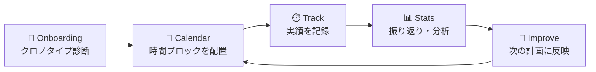
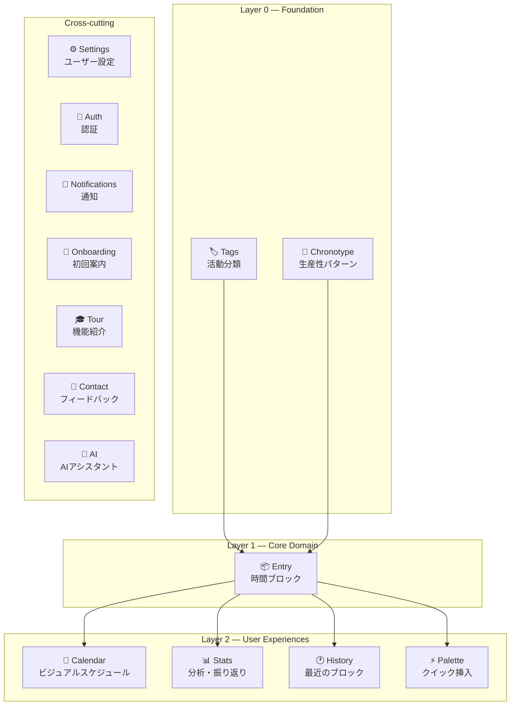

# Dayopt — Product Overview

タイムボクシング × 時間記録 × タスク × カレンダーを一体化した、個人向け生産性アプリ。

---

## コンセプト

最上位のコンセプト定義は [`docs/strategy/concept.md`](../strategy/concept.md) を参照（本ページと矛盾する場合は concept.md を優先する）。

**「装飾のない基本体験」** — GoogleカレンダーやTogglのように、機能を伝えるために必要最小限の要素だけで構成する。

**「Time waits for no one」** — 時間は不可逆。**予定（scheduled start/end）は時間が流れたら凍結**され、未来のブロックだけが編集可能。ステータスを手動管理する必要はない。ただし**記録（実績）はいつでも追記・訂正できる**（過去ブロックの全読み取り専用ではない。詳細は [ADR-005](./adr/005-time-immutability-principle.md)）。

---

## ターゲットユーザー

世界中の個人ユーザー（B2Bではない）。中でも **AI を使いこなす知的労働者**（タスク管理や情報整理を既に AI や GitHub Issues / Notion 等に任せている人）を最初の楔とする。自分の時間の使い方を計画・記録・振り返りたい人。

---

## コアドメイン

### Entry（エントリ）

Dayoptの中心概念。「時間ブロック」として、計画と記録を統合した単一モデル。

| 属性                          | 説明                                                                                                                                    |
| ----------------------------- | --------------------------------------------------------------------------------------------------------------------------------------- |
| `memo`                        | 一言メモ（自由入力欄。リンク貼付可）。タイトル欄は存在しない — 入力の最小単位はタグ（詳細は [concept.md §4-2](../strategy/concept.md)） |
| `start_time` / `end_time`     | いつ行うか（タイムボクシング）                                                                                                          |
| `actual_start` / `actual_end` | 実際にいつ行ったか（時間記録）                                                                                                          |
| `origin`                      | `planned`（事前計画）or `unplanned`（アドホック）                                                                                       |
| `fulfillment_score`           | 1-5の達成度スコア（振り返り用）                                                                                                         |
| `tags`                        | 活動分類（コロン区切り階層: `仕事:開発`, `学習:英語`）                                                                                  |

### EntryState（時間位置による自動判定）

```
         now
          │
──────────┼──────────────────────
 past     │ active    │ upcoming
(読取専用) │(実行中)   │(編集可能)
```

### Chronotype（クロノタイプ）

ユーザーの生産性パターン。Lion / Bear / Wolf / Dolphin の4タイプに基づき、1日のエネルギーゾーンを可視化。

---

## ユーザージャーニー



1. **Onboarding** — クロノタイプ診断でエネルギーパターンを把握
2. **Calendar** — Day/Week/MultiDay ビューで時間ブロックを視覚的に配置
3. **Track** — 実行後に実績時間と達成度を記録
4. **Stats** — Insights（エネルギーマップ、見積精度）と Progress（目標達成率）で振り返り
5. **Improve** — 分析結果をもとに次の計画を改善

---

## Feature Map

15の機能モジュールがDAG（有向非巡回グラフ）で依存関係を構成：



**Layer 0** はどの機能にも依存しない基盤。**Layer 1** は Layer 0 のみに依存。**Layer 2** は Layer 0/1 に依存。この階層は ESLint で強制される。

> **注**: `ai` feature は in-app AI 機能ではなく MCP/API 経由の外部 AI 連携を指す。`notifications` は「計画に仕える」opt-in 通知のみを扱う（アプリの都合での通知は行わない）。詳細は [concept.md §4](../strategy/concept.md)。

---

## 画面構成

| 画面               | ルート                 | 主な機能                                             |
| ------------------ | ---------------------- | ---------------------------------------------------- |
| Calendar (Day)     | `/day`                 | 1日の時間ブロック配置、ドラッグ&ドロップ             |
| Calendar (Week)    | `/week`                | 週間俯瞰、複数日比較                                 |
| Stats - Insights   | `/stats/insights`      | エネルギーマップ、見積精度、コンテキストスイッチ分析 |
| Stats - Progress   | `/stats/progress`      | 目標達成率、タグ別時間推移                           |
| Stats - Tag Detail | `/stats/tags/[tagId]`  | 特定タグの詳細分析                                   |
| Settings           | `/settings/[category]` | プロフィール、表示、通知、課金、データ管理           |

---

## Tech Stack

| レイヤー       | 技術                                                  |
| -------------- | ----------------------------------------------------- |
| フレームワーク | Next.js 15 (App Router) / React 19                    |
| 言語           | TypeScript strict                                     |
| API            | tRPC v11（Router → Service → Supabase 3層パターン）   |
| DB             | Supabase (PostgreSQL + RLS)                           |
| 状態管理       | Zustand（グローバル）/ TanStack Query（サーバー状態） |
| UI             | shadcn/ui (Radix) + Tailwind CSS v4                   |
| バリデーション | Zod                                                   |
| 監視           | Sentry                                                |

---

## 次に読むべきドキュメント

| ドキュメント                                   | 内容                          |
| ---------------------------------------------- | ----------------------------- |
| [Domain Glossary](./domain-glossary.md)        | ドメイン用語の定義            |
| [Data Flow](./data-flow.md)                    | データの流れ（UI → API → DB） |
| [ADR-001](./adr/001-unified-block-model.md)    | Entry統合モデルの設計判断     |
| [State Management](./state-management.md)      | 状態管理の使い分け            |
| Colors（Storybook: Shared/Foundations/Colors） | デザイントークン              |
