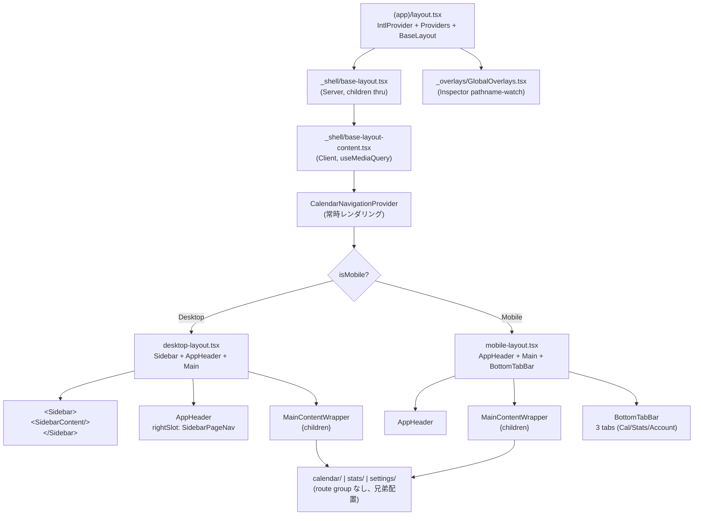
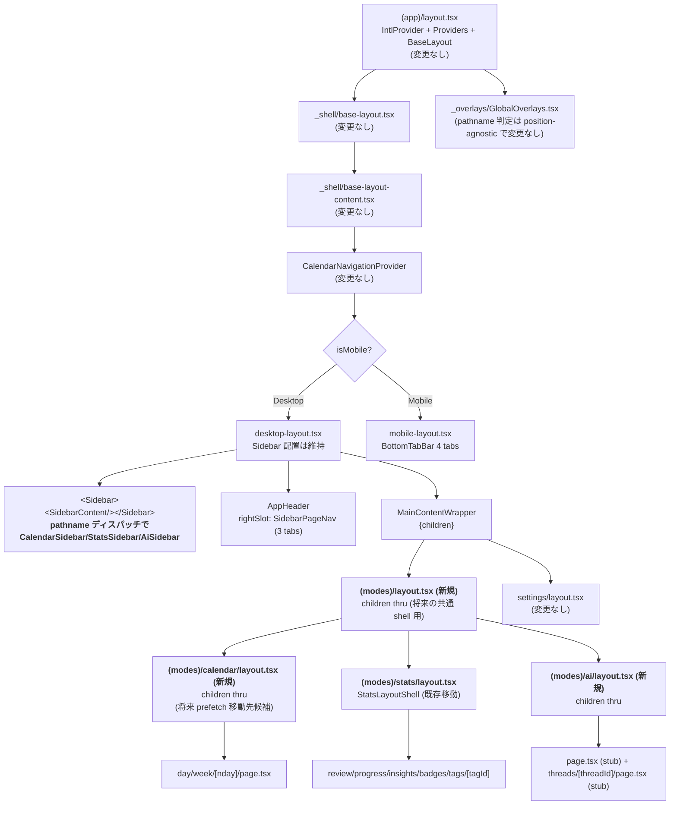

# Phase 2-C 詳細設計: 3 モード layout 再編

> **策定日**: 2026-04-22
> **Parent**: `../sidebar-redesign/overview.md` §4-5
> **前提**: Phase 2-B 完了 (ClientPageRouter 撤去 + Link 化 / 8 コミット)
> **Phase**: 2-C (実施中 — Step C-1 完了)
> **スコープ**: `(modes)` route group 導入 + Sidebar モード別分離 + AI stub + Mobile 4 タブ化 + Desktop PageNav 3 タブ化
>
> **Step 別詳細設計**:
>
> - Step C-1: 実施済 (commit `a2c962f5e` + `e66c103fa`)
> - Step C-2: 実施済 (commit `0c89531e3`) — [step-2-detail.md](./step-2-detail.md)
> - Step C-3: 実施済 (commit `972802e7f`) — [step-3-detail.md](./step-3-detail.md)
> - Step C-4: [step-4-detail.md](./step-4-detail.md) — BottomTabBar 4 タブ化の詳細設計

## Context

Phase 2-A の設計書 §4-5 で Phase 2-C の大枠は確定済み。本ドキュメントは Phase 2-B 実施で得た知見 (特に「Sidebar は既に DesktopLayout スコープで静止している」) を反映して、実装前の詳細設計を固める。

## Phase 2-B で得た知見の反映

| #   | 知見                                                                                          | Phase 2-A の想定                                                           | Phase 2-C での再判断                                                                                                                    |
| --- | --------------------------------------------------------------------------------------------- | -------------------------------------------------------------------------- | --------------------------------------------------------------------------------------------------------------------------------------- |
| K1  | ClientPageRouter は dead code だった。Sidebar 静止は DesktopLayout の layout スコープで実現済 | 「Sidebar ちらつき対策」として妥協案 (各モード layout が Sidebar 全体描画) | Sidebar を**各モード layout に下ろす必要がない**。DesktopLayout の Sidebar 位置は保持し、**中身だけ pathname で切替** (Option Y を推奨) |
| K2  | SSR prefetch が CSR バイパスで壊れていたが Phase 2-B で復活                                   | prefetch 経路は `HydrationBoundary` 維持のみ言及                           | Phase 2-C の layout 再編で prefetch を壊さない制約を明記。各 page.tsx の `prefetchCalendarData` / `prefetchStatsData` 位置は不変        |
| K3  | a11y セマンティクスが nav + aria-current に統一済                                             | tablist/tab セマンティクスが混在していた                                   | 3 モード化でも同セマンティクスを維持。AI タブも `<Link aria-current="page">`                                                            |
| K4  | Inspector auto-close が pathname watch で実装済 (`pathname.includes('/calendar/')`)           | resetToServer 撤去時に手動確認                                             | `(modes)/calendar/` に移動しても prefix 判定は position-agnostic で**変更不要**                                                         |
| K5  | `SidebarContent` が既に `pathname.includes('/stats')` で分岐済                                | -                                                                          | 「Sidebar 中身の pathname ディスパッチ」は既存実装の延長で自然 → Option Y の採用根拠                                                    |

---

## 章立て

1. [現状 layout 構造 (Phase 2-B 後)](#1-現状-layout-構造-phase-2-b-後)
2. [目標 layout 構造 (Phase 2-C 完了後)](#2-目標-layout-構造-phase-2-c-完了後)
3. [(modes) route group 設計](#3-modes-route-group-設計)
4. [Sidebar 外殻分離: Option 比較と推奨](#4-sidebar-外殻分離-option-比較と推奨)
5. [AI モード stub 設計](#5-ai-モード-stub-設計)
6. [Mobile 4 タブ化](#6-mobile-4-タブ化)
7. [Desktop PageNav 3 タブ化](#7-desktop-pagenav-3-タブ化)
8. [i18n namespace 方針](#8-i18n-namespace-方針)
9. [移行リスク再整理](#9-移行リスク再整理)
10. [Step 分割案](#10-step-分割案)
11. [手動確認シナリオ](#11-手動確認シナリオ-3-モード拡張)
12. [相談事項 (ユーザー判断が必要)](#12-相談事項-ユーザー判断が必要)

---

## 1. 現状 layout 構造 (Phase 2-B 後)



**現状の特徴**:

- Sidebar は `desktop-layout.tsx` で唯一マウント (再マウント 0 回)
- `SidebarContent` が `pathname.includes('/stats')` で MiniCalendar の date ソースを分岐
- `SidebarPageNav` は 3 箇所に配置: DesktopLayout の AppHeader rightSlot / `CalendarViewClient` の独自ヘッダー / `stats/layout.tsx` の StatsLayoutShell
- `calendar/` / `stats/` / `settings/` は `(app)/` 直下の兄弟ルート
- `stats/layout.tsx` は存在、`calendar/layout.tsx` は**存在しない**、`settings/layout.tsx` は最小ラッパー

---

## 2. 目標 layout 構造 (Phase 2-C 完了後)



**目標の特徴**:

- **Sidebar 位置は不変** (desktop-layout.tsx のまま、再マウント 0 回を維持)
- **SidebarContent が 3 モードディスパッチ** に拡張 (Option Y 採用)
- `(modes)` route group 配下に `calendar / stats / ai` を配置 (URL は変わらない)
- `settings` は `(app)/` 直下のまま (モード外)
- **各モード layout.tsx は最小 (children thru)**。StatsLayoutShell のみ既存維持

---

## 3. (modes) route group 設計

### 3.1 ディレクトリ移動

| Before                               | After                                         | 備考         |
| ------------------------------------ | --------------------------------------------- | ------------ |
| `src/app/[locale]/(app)/calendar/**` | `src/app/[locale]/(app)/(modes)/calendar/**`  | URL は不変   |
| `src/app/[locale]/(app)/stats/**`    | `src/app/[locale]/(app)/(modes)/stats/**`     | URL は不変   |
| -                                    | `src/app/[locale]/(app)/(modes)/ai/**` (新規) | AI mode stub |
| `src/app/[locale]/(app)/settings/**` | 変更なし                                      | モード外     |

**新規作成ファイル**:

- `(modes)/layout.tsx` (children thru、将来の共通 shell 用 placeholder)
- `(modes)/calendar/layout.tsx` (children thru、将来 prefetch 移動先候補)
- `(modes)/ai/layout.tsx` (children thru)
- `(modes)/ai/page.tsx` (stub)
- `(modes)/ai/threads/[threadId]/page.tsx` (stub)
- `(modes)/ai/_composition/AiSidebar.tsx` (stub)
- `(modes)/ai/_composition/AiMainContent.tsx` (stub)

**移動時の import パス修正**:

| ファイル                                                                 | 修正前                          | 修正後                             |
| ------------------------------------------------------------------------ | ------------------------------- | ---------------------------------- |
| `(modes)/calendar/_composition/CalendarViewClient.tsx`                   | `'../../_shell/SidebarPageNav'` | `'../../../_shell/SidebarPageNav'` |
| `(modes)/stats/layout.tsx`                                               | `'../_shell/SidebarPageNav'`    | `'../../_shell/SidebarPageNav'`    |
| `(modes)/stats/_composition/StatsLayoutShell.tsx` 内の相対 import も確認 | (調査結果次第)                  | depth +1                           |

**変更不要な箇所** (position-agnostic):

- `GlobalOverlays.tsx` L90: `pathname.includes('/calendar/')` (prefix 判定)
- `SidebarContent.tsx` L27: `pathname.includes('/stats')` (prefix 判定)
- `BottomTabBar.tsx` L20-29: `getActiveTabFromPath(pathname)` (prefix 判定)
- `SidebarPageNav.tsx`: `getActivePageFromPath(pathname)` (prefix 判定)
- E2E spec の URL アサーション (`/ja/calendar/day` etc.) — route group は URL に現れない

### 3.2 Next.js 慣例との整合

- `(modes)` naming: Next.js route group の `(folder)` 慣例に準拠
- 同類事例: Next.js 公式ドキュメントでは `(marketing) / (shop) / (dashboard)` のような naming が推奨
- `(app)` は既存、`(modes)` はその配下のサブグループとして意味的に自然

---

## 4. Sidebar 外殻分離: Option 比較と推奨

Phase 2-A では「妥協案 (各モード layout が Sidebar 全体描画)」を採用する前提だった。Phase 2-B で「Sidebar は既に DesktopLayout で静止している」と判明したため、選択肢を再評価する。

### Option 比較

| Option                                                              | 説明                                                                                                                     | Phase 2-B 知見との整合 | 再マウント回数   | 実装コスト | 抽象化コスト |
| ------------------------------------------------------------------- | ------------------------------------------------------------------------------------------------------------------------ | ---------------------- | ---------------- | ---------- | ------------ |
| **X**: 各モード layout.tsx が `<Sidebar><{Mode}Sidebar/></Sidebar>` | Sidebar 外殻を含めて各モード layout が描画。Phase 2-A の妥協案                                                           | ✕ (Sidebar を下ろす)   | モード切替時に 1 | 中         | 低           |
| **Y**: SidebarContent が pathname ディスパッチ (推奨)               | Sidebar 位置は DesktopLayout のまま。`SidebarContent` が pathname で `CalendarSidebar / StatsSidebar / AiSidebar` を切替 | ◎ (現状維持)           | 0                | 低         | 低           |
| **Z**: Portal / SidebarSlotContext で中身注入                       | 各モード page/layout が `SidebarSlotContext.Provider` で中身を注入。Sidebar 外殻は上位で固定                             | △ (オーバーキル)       | 0                | 高         | 高           |

### 推奨: Option Y

**理由**:

1. **Phase 2-B の成果を保存**: Sidebar 再マウント 0 回を維持できる唯一の案
2. **既存コードの自然な延長**: `SidebarContent` は既に `pathname.includes('/stats')` で MiniCalendar の date ソースを分岐している。3 モード分岐への拡張は既存パターンの素直な延伸
3. **抽象化コスト最小**: Portal や Slot Context のような新パターンを導入しない
4. **Phase 2-C スコープ縮小**: Sidebar 移動が不要になり、実装工数が下がる
5. **将来の逃げ道**: もし後で「モード毎に完全独立な Sidebar が欲しい」となったら Option Z (Portal) に切替可能。Option Y → Option Z の移行は破壊的ではない

**実装方針** (Option Y):

```tsx
// _shell/SidebarContent.tsx の新構造 (擬似コード)
export function SidebarContent() {
  const pathname = usePathname();
  const mode = getModeFromPath(pathname); // 'calendar' | 'stats' | 'ai'

  return (
    <>
      <SidebarHeader />
      {mode === 'calendar' && <CalendarSidebar />}
      {mode === 'stats' && <StatsSidebar />}
      {mode === 'ai' && <AiSidebar />}
      <SidebarUtilities />
    </>
  );
}
```

- `CalendarSidebar`: 現状の MiniCalendar + ViewSwitcherList + CalendarFilterList を抽出
- `StatsSidebar`: MiniCalendar のみ (Stats 独自タグフィルタは Phase 2-A 確定で scope 外)
- `AiSidebar`: Conversations stub list (空状態メッセージ)

**Option Y の既知リスク**:

- `SidebarContent` が肥大化する可能性 → 3 sub-component ファイルに分割することで緩和
- `CalendarFilterStore` が Stats / AI モードでも hydration されるが、購読しなければ再レンダリングは発生しない (既存構造で既に確認済)

### Option X / Z を採用する判定基準 (将来参照用)

- **Option X**: 各モードで Sidebar 外殻 (ロゴ / UserMenu 位置) が大きく異なる設計になった時
- **Option Z**: モード毎のサイドバー中身が `features/{mode}/` 配下に深く閉じて、layout 側で注入する方が DAG 的に綺麗になった時

現時点ではどちらの条件も満たさない。

---

## 5. AI モード stub 設計

### 5.0 品質水準 (2026-04-22 ユーザー確定)

stub は「白画面」や「Coming Soon」のみの素っ気ない表示を**避ける**。launch 時に「これから何が来るか」のプレビューとして機能させ、壊れていると誤解されない水準で作る。ただし CTA ボタンや具体的な機能紹介で過度な期待は生まない。

### 5.1 ディレクトリ構造

```
(modes)/ai/
├── layout.tsx                             children thru (最小)
├── page.tsx                               AI モードトップ (stub)
├── threads/
│   └── [threadId]/
│       └── page.tsx                       Thread detail (stub)
└── _composition/
    ├── AiSidebar.tsx                      Sidebar 中身 stub
    ├── AiMainContent.tsx                  メイン stub (empty state)
    ├── AiSoonList.tsx                     Sidebar 下部の予定機能リスト
    └── AiThreadPlaceholder.tsx            Thread detail stub
```

### 5.2 AI Sidebar (AiSidebar.tsx)

以下 3 ブロックで構成:

#### ブロック 1: タイトル

- "Watching AI" のタイトル表示 (既存 SidebarHeader とは別、Sidebar 中身の最上部)

#### ブロック 2: Conversations list (空)

- 実データなしの空 list
- 描画構造のみ用意 (将来 `<AiConversationsList/>` で差し替え可能な形)
- 空状態メッセージ: copywriting.md 準拠の観察的トーン (感嘆符なし)
  - 例: "観察がここに並びます" / "Observations will appear here"

#### ブロック 3: Soon セクション (下部)

予定機能を 3 項目列挙、各項目は **lucide アイコン + タイトル + 1 行説明**:

| 項目              | アイコン候補  | 説明 (1 行)                              |
| ----------------- | ------------- | ---------------------------------------- |
| 週次レポート      | `FileText`    | 今週の時間の使い方をまとめてお届けします |
| 気づき (Insights) | `Lightbulb`   | パターンから見つけた気づきを共有します   |
| 異常検知          | `AlertCircle` | いつもと違う兆しを静かにお知らせします   |

各項目は disabled 見た目 (`text-muted-foreground` トーン) で **clickable ではない**。

### 5.3 AI メインエリア (AiMainContent.tsx)

中央寄せの illustrated empty state:

- **アイコン**: `Eye` (icon-conventions.md 採用済) を大きめサイズ (`h-16 w-16` 程度) で表示。`text-muted-foreground` トーン
- **タイトル**: "Watching AI は準備中" / "Watching AI is coming"
- **説明文** (2-3 行):
  - 日本語: "あなたの時間の使い方を観察し、パターンを見つけて気づきをお届けします。"
  - 英語: "Observes how you spend time, finds patterns, and shares what it notices."
- **CTA ボタン**: **なし**。起動できる機能がないため
- **copywriting.md 準拠**:
  - 研究者トーン (「〜します」の淡々とした宣言)
  - 「地図」メタファーは必要に応じて (タイトル/説明には無理に入れない)
  - 感嘆符なし、煽りなし

### 5.4 Thread detail stub (threads/[threadId]/page.tsx)

- route 存在確認のみ (404 を避ける)
- content は最小 placeholder:
  - "このスレッドは準備中です" / "This thread is coming soon"
- Mobile で push navigation 動線を確保 (iOS 標準パターン検証のため)
- back ボタンで `/ai` に戻れることを確認

### 5.5 `src/features/ai/` は新設しない (Phase 2-A §9 確定)

- Phase 2-C では `(modes)/ai/_composition/` 配下に閉じる
- 将来 Watching AI 本実装時に `features/ai/` 昇格を判断

### 5.6 必要な翻訳キー (Step C-3 で追加)

新規 namespace `ai` を作成し、以下のキーを ja / en 両方で追加:

| キー                                       | 用途                                 |
| ------------------------------------------ | ------------------------------------ |
| `ai.sidebar.title`                         | Sidebar タイトル "Watching AI"       |
| `ai.sidebar.conversations.empty`           | Conversations list 空状態メッセージ  |
| `ai.sidebar.soon.label`                    | Soon セクションのラベル              |
| `ai.sidebar.soon.weeklyReport.title`       | "週次レポート"                       |
| `ai.sidebar.soon.weeklyReport.description` | 1 行説明                             |
| `ai.sidebar.soon.insights.title`           | "気づき"                             |
| `ai.sidebar.soon.insights.description`     | 1 行説明                             |
| `ai.sidebar.soon.anomaly.title`            | "異常検知"                           |
| `ai.sidebar.soon.anomaly.description`      | 1 行説明                             |
| `ai.main.title`                            | メインエリアタイトル "準備中"        |
| `ai.main.description`                      | メインエリア説明文 (2-3 行)          |
| `ai.thread.placeholder`                    | Thread detail の "準備中" メッセージ |

加えて navigation namespace に:

| キー                      | 用途                                     |
| ------------------------- | ---------------------------------------- |
| `navigation.bottomTab.ai` | Mobile BottomTabBar ラベル               |
| `navigation.sidebar.ai`   | Desktop SidebarPageNav ラベル (3 タブ化) |

### 5.7 stub の意図 (将来参照用)

- launch 時に「これから何が来るか」のプレビューとして機能
- ユーザーに「壊れている」と誤解されない (空画面や "Coming Soon" のみは避ける)
- CTA ボタンなし / 具体的な機能紹介なしで、過度な期待を生まない
- launch 後の Watching AI 本実装時に、stub の構造をそのまま実 component に置換可能

---

## 6. Mobile 4 タブ化

### 6.1 BottomTabBar の拡張 (3 → 4 タブ)

| tab.id     | ラベル翻訳キー                       | アイコン       | href                     |
| ---------- | ------------------------------------ | -------------- | ------------------------ |
| `calendar` | `navigation.bottomTab.calendar`      | CalendarDays   | `buildCalendarPath(...)` |
| `stats`    | `navigation.bottomTab.stats`         | BarChart3      | `buildStatsPath(...)`    |
| **`ai`**   | **`navigation.bottomTab.ai` (新規)** | **Eye (新規)** | **`/${locale}/ai`**      |
| `account`  | `navigation.bottomTab.account`       | UserCircle     | `/${locale}/settings`    |

**アイコン選定**: AI には Eye (`src/lib/styles/tokens/IconConventions.mdx` で Watching AI 用として採用済)

### 6.2 サイズと配分

- 4 等分配分 (tab width = `100% / 4`)
- tab bar 高さは現行 `h-14` を維持 (iOS / Material ガイド内)
- ボトムセーフエリア: 現行 `pb-safe` 等で対応済 (変更不要)
- 押しやすさ: 各タブ `flex-1` で等分、タッチターゲット最低 44px は `h-14` で担保

### 6.3 Mobile での AI モード挙動

- AI トップ (`/ai`): plain list 全画面表示 (Phase 2-C では stub list)
- Thread detail (`/ai/threads/[threadId]`): push navigation で遷移 (iOS 標準パターン)
- Phase 2-C では実データなし、空状態メッセージで画面を埋める

---

## 7. Desktop PageNav 3 タブ化

### 7.1 SidebarPageNav の拡張 (2 → 3 タブ)

現状:

```tsx
<PageNav activePage={activePage} calendarHref={calendarHref} statsHref={statsHref} />
```

Phase 2-C:

```tsx
<PageNav
  activePage={activePage}
  calendarHref={calendarHref}
  statsHref={statsHref}
  aiHref={aiHref} // 新規
/>
```

- `getActivePageFromPath(pathname)` に `'ai'` ケースを追加
- `aiHref = `/${locale}/ai`` (stub なので静的)

### 7.2 3 箇所の配置

現状 3 箇所に `<SidebarPageNav />` が配置されている。Phase 2-C でも 3 箇所すべてに AI タブが反映される必要がある:

1. `desktop-layout.tsx` L80 (AppHeader rightSlot)
2. `(modes)/calendar/_composition/CalendarViewClient.tsx` L114 (Calendar 独自ヘッダー)
3. `(modes)/stats/layout.tsx` L12 (StatsLayoutShell headerRightExtra)

**修正箇所**: `SidebarPageNav.tsx` と `PageNav.tsx` のみ。配置箇所は触らない (AI タブが自動で 3 箇所に反映される)。

### 7.3 v2 デザイン (選択時ラベル展開) の適用判断

Phase 2-A 以前に議論された「選択時ラベル展開 + アイコンのみ非選択」の v2 デザインは **Phase 2-C スコープ外** とする。

**理由**:

- 2-C のスコープは routing 構造の再編が主軸。UI デザイン変更は blast radius を切り分けるべき
- v2 デザインは Calendar / Stats 2 タブ前提で議論されていた。3 タブでの visual balance は別検証が必要
- 先に 3 タブで現行デザインを安定させ、後続タスクで v2 デザイン検討 (相談事項 D に記載)

---

## 8. i18n namespace 方針

### 8.1 AI モード翻訳キーの配置

**推奨: 既存 `navigation` namespace に追加 + 新規 `ai` namespace 新設**

| キー                         | namespace  | 用途                                 |
| ---------------------------- | ---------- | ------------------------------------ |
| `navigation.bottomTab.ai`    | navigation | Mobile BottomTabBar ラベル           |
| `navigation.sidebar.ai`      | navigation | Desktop SidebarPageNav ラベル        |
| `ai.placeholder.title`       | ai         | AI トップの "開発中" タイトル        |
| `ai.placeholder.description` | ai         | AI トップの説明文 (地図メタファー)   |
| `ai.sidebar.emptyState`      | ai         | Conversations list 空状態メッセージ  |
| `ai.thread.placeholder`      | ai         | Thread detail の "未実装" メッセージ |

**理由**:

- `navigation.*` は既にタブラベル用 namespace として機能している。AI タブラベルを同居させるのが自然
- AI 固有のコピー (placeholder / sidebar / thread) は将来 Watching AI 本実装時に大量追加される見込み。早期に独立 namespace `ai` を作る方が後の拡張がクリーン

### 8.2 APP_NAMESPACES の更新

`(app)/layout.tsx` L32-46 の `APP_NAMESPACES` に `'ai'` を追加。

```typescript
const APP_NAMESPACES = [
  'badges',
  'common',
  'calendar',
  'entry',
  'plan',
  'record',
  'tags',
  'navigation',
  'sidebar',
  'settings',
  'error',
  'contact',
  'tour',
  'ai', // 新規
];
```

**チェック**: Phase 2-A R4 (architecture.md の事故例) に従い、`grep -rn "useTranslations('ai'" src` で参照確認を migration checklist に含める。

---

## 9. 移行リスク再整理

### 9.1 Phase 2-A R1-R10 の再評価

| #   | リスク                               | Phase 2-B 結果                             | Phase 2-C での扱い                                                                  |
| --- | ------------------------------------ | ------------------------------------------ | ----------------------------------------------------------------------------------- |
| R1  | 戻る/進む                            | ✅ 解消 (E2E regression guard)             | 2-C で追加の 3 モード往復 spec を追加                                               |
| R2  | Deep link `/stats/tags/[tagId]`      | ✅ 解消 (ClientPageRouter 撤去)            | route group 移動で URL 不変のため再発リスクなし                                     |
| R3  | SSR prefetch キャッシュ              | ✅ むしろ改善                              | 2-C の layout 再編で prefetch 位置を壊さないことを確認 (各 page.tsx で呼ぶ現状維持) |
| R4  | i18n namespace                       | ✅ 発生せず                                | 2-C で `ai` namespace 追加時に grep チェック実施                                    |
| R5  | Sidebar ちらつき                     | 2-B では layout 再編なしで未測定           | **Option Y 採用で Sidebar 再マウント 0 回を維持** → ちらつきリスクは事実上解消      |
| R6  | Storybook mocks                      | ✅ 発生せず                                | 2-C で CalendarSidebar / StatsSidebar / AiSidebar の Story 追加時に mock 更新確認   |
| R7  | Inspector navigation                 | ⚠️ 既存欠損を手動確認で発見、先行 fix 実施 | pathname 判定 position-agnostic で 2-C 後も機能する (K4)                            |
| R8  | `CalendarNavigationProvider` の位置  | ✅ 維持                                    | `(app)/base-layout-content.tsx` のまま (モード外で state 保持)                      |
| R9  | `useShellStore.pageTitle` タイミング | ✅ 発生せず                                | 2-C の AI page.tsx でも `setPageTitle` を呼ぶ                                       |
| R10 | iOS PWA sentinel                     | ✅ 発生せず                                | 変更なし                                                                            |

### 9.2 Phase 2-C 固有の新規リスク

| #   | リスク                                                    | 対策                                                                                                                       | 検証                          |
| --- | --------------------------------------------------------- | -------------------------------------------------------------------------------------------------------------------------- | ----------------------------- |
| C1  | ディレクトリ移動による相対 import 破損                    | Step C-1 で `git mv` を使い、import path は手動確認 + typecheck で検出                                                     | `npm run typecheck` pass      |
| C2  | ディレクトリ移動によるビルドキャッシュ不整合              | `rm -rf .next && npm run build` で確認                                                                                     | build pass                    |
| C3  | 既存 E2E spec の path 依存                                | URL 依存は route group で変わらないため影響なし。ファイルパスハードコードなし (調査済)                                     | `npm run test:e2e:smoke` pass |
| C4  | Storybook story の path 依存                              | Story ファイル内のハードコードなし (調査済)。Sidebar 3 分割時に新 Story 追加                                               | `npm run storybook` 起動      |
| C5  | AI stub での未実装領域のユーザー接触                      | "開発中" placeholder を明示。CTA なし。将来の実装予告コピー                                                                | copywriting.md 準拠確認       |
| C6  | `SidebarContent` の pathname ディスパッチで mode 判定ミス | `getModeFromPath(pathname)` を独立 util として切り出し、unit test を追加                                                   | vitest                        |
| C7  | 4 タブ化で Mobile tab width が窮屈になる                  | `h-14` 維持 + `flex-1` 等分で各タブ幅を iOS 最小タッチターゲット (44px) 以上に。実機確認                                   | 手動 (Mobile viewport)        |
| C8  | `APP_NAMESPACES` への `ai` 追加漏れ                       | Step C-3 のチェックリストに grep 確認を含める                                                                              | `lint:i18n`                   |
| C9  | `(modes)/layout.tsx` が空 layout として正しく機能するか   | Next.js の route group 仕様上、children thru layout.tsx は valid。ただし Phase 2-C で**作成不要**な可能性あり (相談事項 A) | build pass                    |
| C10 | Stats の `StatsLayoutShell` 移動時の import 破損          | `(modes)/stats/_composition/StatsLayoutShell.tsx` の相対 import を手動確認 + typecheck                                     | typecheck                     |

---

## 10. Step 分割案

Phase 2-B の 8 コミット実績を踏まえ、Phase 2-C は **6 Step / 6-7 コミット** に分割する。

### 10.1 Step 一覧

| Step | 内容                                                           | 触るファイル (概算)                                                                                                           | ゲート                               | blast radius |
| ---- | -------------------------------------------------------------- | ----------------------------------------------------------------------------------------------------------------------------- | ------------------------------------ | ------------ |
| C-1  | `(modes)` route group 作成 + calendar / stats ディレクトリ移動 | calendar/** → (modes)/calendar/**, stats/** → (modes)/stats/**, 相対 import 修正 (2-3 箇所)                                   | typecheck / build / 手動             | 大           |
| C-2  | `SidebarContent` を `CalendarSidebar` / `StatsSidebar` に分割  | `_shell/SidebarContent.tsx`, 新規 `CalendarSidebar.tsx` / `StatsSidebar.tsx`, `getModeFromPath` util                          | typecheck / lint / test              | 中           |
| C-3  | AI モード stub 追加 (`(modes)/ai/**` + `AiSidebar`)            | (modes)/ai/layout.tsx / page.tsx / threads/[threadId]/page.tsx / \_composition/\*\*, SidebarContent に AI 分岐追加, i18n 追加 | typecheck / 手動 (AI ページ到達確認) | 中           |
| C-4  | `BottomTabBar` 4 タブ化                                        | `_shell/BottomTabBar.tsx`, `BottomTabBar.test.tsx`, `navigation.json` (ja/en)                                                 | typecheck / test / 手動 (Mobile)     | 小           |
| C-5  | `SidebarPageNav` / `PageNav` 3 タブ化                          | `_shell/SidebarPageNav.tsx`, `lib/components/shell/sidebar/PageNav.tsx`                                                       | typecheck / lint / 手動 (Desktop)    | 小           |
| C-6  | E2E smoke 追加 (3 モード対応) + Storybook story 更新           | `e2e/**`, `*.stories.tsx` (Sidebar 3 分割分)                                                                                  | test:e2e:smoke / storybook 起動      | 小           |

### 10.2 コミット戦略

- **コミット 1** (Step C-1): route group 移動を独立コミットに。blast radius 最大
- **コミット 2** (Step C-2): Sidebar 分割のみ
- **コミット 3** (Step C-3): AI stub 追加 (feat 扱い、refactor ではない)
- **コミット 4** (Step C-4): BottomTabBar 4 タブ化
- **コミット 5** (Step C-5): SidebarPageNav 3 タブ化
- **コミット 6** (Step C-6): E2E + Storybook 更新

コミットメッセージ prefix:

- `refactor(routing): (modes) route group 導入と calendar/stats 移動`
- `refactor(sidebar): SidebarContent を mode 別 component に分割`
- `feat(ai): AI モードの stub layout と stub pages を追加`
- `feat(navigation): BottomTabBar を 4 タブ化 (AI 追加)`
- `feat(navigation): SidebarPageNav を 3 タブ化 (AI 追加)`
- `test(e2e): phase 2-c の 3 モード対応に smoke test を拡張`

### 10.3 各 Step の手動確認ゲート

| Step | 手動確認内容                                                                                        |
| ---- | --------------------------------------------------------------------------------------------------- |
| C-1  | Desktop / Mobile で Calendar / Stats の URL 直アクセスと往復、Sidebar / BottomTabBar が従来通り動作 |
| C-2  | Calendar ↔ Stats 往復で Sidebar 中身が正しく切替、再マウント 0 回 (React DevTools Profiler で確認)  |
| C-3  | `/ja/ai` / `/ja/ai/threads/abc` 直アクセスで stub 描画、AI モード時に Sidebar が `AiSidebar` に切替 |
| C-4  | Mobile で AI タブが表示され、タップで `/ja/ai` に遷移、4 等分配分でレイアウト崩れなし               |
| C-5  | Desktop で AI タブが表示され、クリックで `/ja/ai` に遷移、aria-current が正しく設定                 |
| C-6  | 既存 E2E + 新 spec 全 pass、Storybook が Sidebar 3 分割 story で正常描画                            |

---

## 11. 手動確認シナリオ (3 モード拡張)

Phase 2-A §8.2 の 6 シナリオを 3 モードに拡張。

1. **Desktop 3 モード往復**: Calendar → Stats → AI → Calendar。URL / active tab / Sidebar 中身の同期
2. **Mobile 3 モード往復**: BottomTabBar 経由で同じ往復 (viewport <768px)
3. **Deep link 直接アクセス**: `/ja/ai` / `/ja/ai/threads/abc` を URL bar 直接 → stub が SSR 描画
4. **ブラウザバック/フォワード**: Calendar → Stats → AI → back × 2 → Calendar 復帰
5. **ページリロード**: AI トップで F5 → stub 描画維持
6. **Inspector → View Stats**: 既存動作維持 (pathname 判定が (modes) 移動後も機能)
7. **Settings モーダル/ページ**: Desktop (モーダル) / Mobile (実ページ) で引き続き動作
8. **Calendar 独自ヘッダーの SidebarPageNav**: `CalendarViewClient` の独自ヘッダーでも 3 タブ表示
9. **Stats の `StatsLayoutShell` headerRightExtra**: Stats ページでも 3 タブ表示
10. **Sidebar 再マウント 0 回の目視確認**: React DevTools Profiler で Calendar ↔ Stats ↔ AI を切替、`<Sidebar>` node の再マウントがないことを確認 (Option Y 採用根拠の検証)

全 pass で Phase 2-C 完了とする。

---

## 12. 相談事項 (2026-04-22 確定)

Phase 2-C 着手前の判断項目 — 全項目が 2026-04-22 にユーザー確定。

### 確定サマリー

| #   | 項目                                   | 確定                                                          |
| --- | -------------------------------------- | ------------------------------------------------------------- |
| A   | `(modes)/layout.tsx` 作成有無          | ✅ **作成しない** (YAGNI)                                     |
| B   | `(modes)/calendar/layout.tsx` 作成有無 | ✅ **作成しない**                                             |
| C   | `(modes)/stats/layout.tsx` 維持        | ✅ **維持** (StatsLayoutShell のため)                         |
| D   | PageNav v2 デザイン適用タイミング      | ✅ **別タスク** (Phase 2-C は構造再編に集中)                  |
| E   | AI stub のユーザー接触範囲             | ✅ **全ユーザー** (feature flag 不要)、品質水準は §5.0 / §5.7 |
| F   | AI アイコン                            | ✅ **Eye** (IconConventions.mdx 採用済)                       |

### 各項目の詳細 (確定理由含む)

### A. `(modes)/layout.tsx` の作成有無

- **背景**: Phase 2-A §4.1 では `(modes)/layout.tsx` を "PageNav shell frame (妥協案では最小実装)" として設計していたが、Option Y 採用で Sidebar / PageNav は DesktopLayout スコープで保持されるため `(modes)/layout.tsx` は**children thru 以外の役割がない**。
- **選択肢**:
  - A-1: `(modes)/layout.tsx` を作成しない (Next.js route group は layout.tsx なしでも機能)
  - A-2: 空 layout.tsx を placeholder として作成 (将来の共通 shell 拡張用)
- **推奨**: **A-1 (作成しない)**。空 layout ファイルは「あとで何かを入れる」という誘惑を生むが、現時点で意味がない。YAGNI 原則。

### B. `(modes)/calendar/layout.tsx` の作成有無

- **背景**: 現状 `calendar/layout.tsx` は存在しない。Phase 2-A §4.1 では `CalendarNavigationProvider + Sidebar<CalendarSidebar/>` を配置する想定だったが、Option Y で両方不要。
- **選択肢**:
  - B-1: 作成しない
  - B-2: prefetch 集約用の placeholder として作成 (現状各 page.tsx で呼んでいる `prefetchCalendarData` を将来 layout に寄せる可能性)
- **推奨**: **B-1 (作成しない)**。prefetch 集約は現状不要で、page.tsx 毎に viewType / date が異なるため layout 集約の利得が低い。

### C. `(modes)/stats/layout.tsx` の維持方針

- **背景**: 現状 `stats/layout.tsx` が `StatsLayoutShell` でラップしている。これは (modes)/stats/ 移動後も維持。
- **選択肢**: 維持 (既存実装)
- **推奨**: **維持**。StatsLayoutShell は pathname から activeTab を判定する必要があるため layout での共通化が正当。

### D. PageNav v2 デザインの適用タイミング

- **背景**: 以前の議論で「選択時ラベル展開 + アイコンのみ非選択」の v2 デザインが俎上にあった。
- **選択肢**:
  - D-1: Phase 2-C で同時適用 (blast radius +1、UI 変更と routing 変更が混在)
  - D-2: Phase 2-C 後の別タスクで適用 (Phase 2-C は routing/layout 再編に集中)
- **推奨**: **D-2 (別タスク)**。Phase 2-B で routing 変更と UI 変更を分離する方針が確立された (Inspector fix も本線から切り離した)。同じ原則を適用する。

### E. AI stub のユーザー接触許容範囲

- **背景**: Mobile BottomTabBar の AI タブは常時表示されるため、全ユーザーが AI モードに到達可能になる。
- **選択肢**:
  - E-1: 全ユーザーに stub を見せる ("開発中" placeholder を表示)
  - E-2: feature flag で AI タブを非表示にして dogfooding ユーザーのみに見せる
  - E-3: `process.env.NODE_ENV !== 'production'` で本番は非表示
- **推奨**: **E-1 (全ユーザーに見せる)**。理由: (a) Phase 2-C の目的は AI モードの構造的導入、UX テストではない (b) "開発中" placeholder が copywriting.md の研究者トーンに沿えば違和感なし (c) feature flag を増やすと Phase 2-D の本実装時に撤去コストが発生。ただしユーザー判断次第。

### F. AI アイコンの確認

- **背景**: `IconConventions.mdx` で Eye アイコンを Watching AI 用として採用済の前提で設計したが、確認が必要。
- **選択肢**: Eye / Brain / Sparkles / Bot など
- **推奨**: **Eye (既存採用の維持)**。変更する場合は IconConventions.mdx も同時更新。

---

## Critical Files (Phase 2-C スコープ)

- [src/app/[locale]/(app)/layout.tsx](<../../../../src/app/[locale]/(app)/layout.tsx>) — `APP_NAMESPACES` に `'ai'` 追加
- [src/app/[locale]/(app)/\_shell/SidebarContent.tsx](<../../../../src/app/[locale]/(app)/_shell/SidebarContent.tsx>) — mode ディスパッチに拡張 (Option Y)
- [src/app/[locale]/(app)/\_shell/SidebarPageNav.tsx](<../../../../src/app/[locale]/(app)/_shell/SidebarPageNav.tsx>) — 3 タブ化
- [src/app/[locale]/(app)/\_shell/BottomTabBar.tsx](<../../../../src/app/[locale]/(app)/_shell/BottomTabBar.tsx>) — 4 タブ化
- [src/lib/components/shell/sidebar/PageNav.tsx](../../../../src/lib/components/shell/sidebar/PageNav.tsx) — 3 タブ対応
- [src/app/[locale]/(app)/calendar/\*\*](<../../../../src/app/[locale]/(app)/calendar/>) — `(modes)/calendar/**` に移動
- [src/app/[locale]/(app)/stats/\*\*](<../../../../src/app/[locale]/(app)/stats/>) — `(modes)/stats/**` に移動
- `src/app/[locale]/(app)/(modes)/ai/**` — 新規作成
- [messages/ja/navigation.json](../../messages/ja/navigation.json) / en — AI タブラベル追加
- `messages/ja/ai.json` / en — 新規作成

---

## 次のアクション

1. 本設計書をレビュー
2. 相談事項 A-F のユーザー判断を確定
3. Phase 2-C Step C-1 の実装プロンプトを詰める (route group 移動)
4. Step C-1 完了後、Sidebar 再マウント 0 回の React DevTools Profiler 確認を実施 (Option Y 採用根拠の検証)
